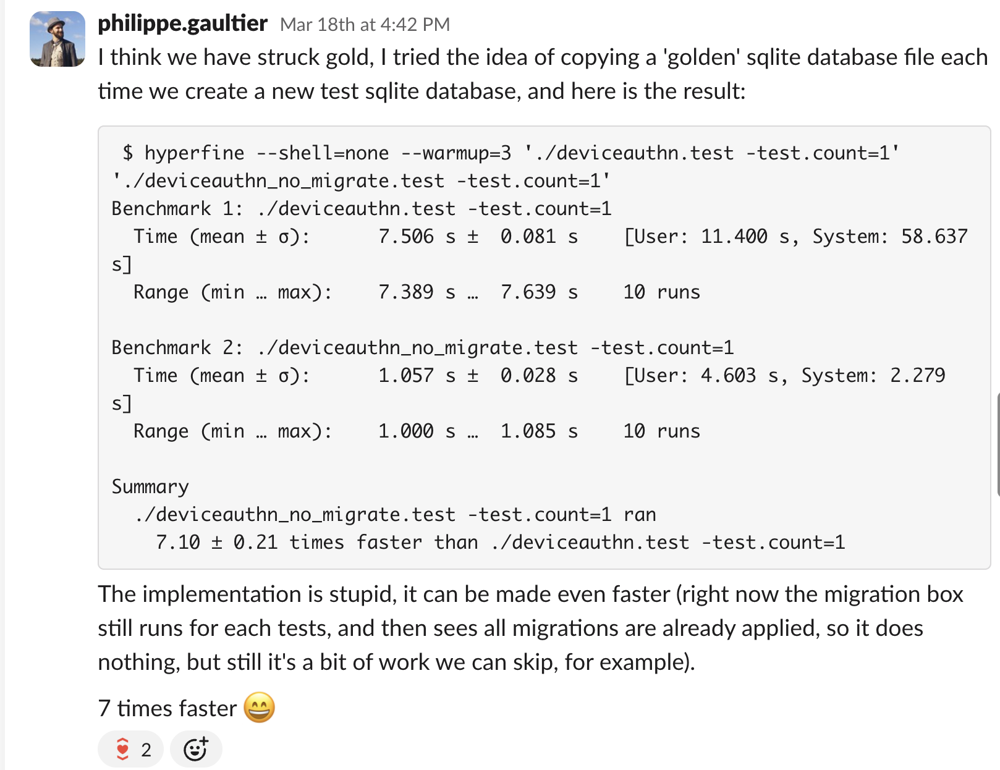

Title: I sped up the test suite by x2 with one simple change
Tags: Go, SQL, Optimization
---

We have a giant test suite at work, mostly in Go. The test coverage is great, but it means that it's not *that* fast to run, and it only will get slower over time. Almost every test needs a pristine database. We are spending a ton of CPU time just applying again and again the same SQL migrations at the start of each test.

As mentioned in a [previous article](/blog/an_optimization_and_debugging_story_go_dtrace.html), thousands (!) of SQL migrations have accumulated over the years, and I had to fix a performance issue where we spent a lot of time simply gathering all migration files (not even applying them).

With that fix done, the next bottleneck was applying these migrations. A few reasons make this part very appealing to optimize:

- Every test using a database runs this code
- Applying the migrations is done serially (one at a time) and no test code can run until migrations are fully applied
- It is entirely unnecessary to apply each migration one by one, nearly all tests are only interested in the latest database schema

And so I decided to optimize it. When doing performance optimizations, it's important to spend some time first deciding if it's worth your time on paper!

As always: the code is [open-source](https://github.com/ory/x/commit/91e6c4715c2d187b350e3fc589308edd23f6791d).

## Quick and dirty check

Optimization work can be very unrewarding: you spend a lot of time and at then end you measure, to see no difference (or perhaps worse performance than before!). 

So it's also very important, if possible, to do a quick and dirty check at the beginning, to see if the optimization has any legs.

In my case, here's what I wanted to see: let's assume that every test has access to a ready-made database, with an up-to-date database schema. What's the runtime of the test suite then? That's the upper-bound for this work, where I 'optimized' the database migration code to take no time at all.

Thus I did something very simple: I put a breakpoint in one test, right after all database migrations ran. This means the test stopped at a point where a pristine SQLite database was present on disk. I then copied this file with `cp` to my home directory: this is now my golden (immutable) database. I finally modified the migration code (that all tests start with), to never apply any SQL migrations, and instead just copy the golden database file, and use that. 

And this is what I saw:

Alright, it's confirmed that this optimization is worth it!

## The implementation

We could do the same as in the prototype above: assume that a human or a tool maintains a golden database file up to date, and when a test starts, it copies this golden file, and uses it as its database. 

However, that requires some out-of-band process, since new SQL migrations get added every few days, and there is a risk that this golden file gets out of sync.

So I went the other way: at the start of each test, we either use the golden file if it exists, or we lazily (on demand) create it otherwise, and then start using it. 

Due to Go's test framework and the fact that we use a monorepo, running Go tests from many different and unrelated projects, there is no clear entry point for all tests, where we could run our logic[^1]. 

That means that each test must run this logic at the start of the test, and we'll have a contention point when checking if the golden database file already exists, which we accept.

The approach is, if I dare say so, quite elegant:

1. In each test, at the start, call one function to create a new database and apply all database migrations to it.
2. In this function, first check if the golden database file exists. If it does, simply copy[^2] it to a uniquely named file, and immediately return this name, so that the test can then use it, fully isolated from the other tests.
3. If the golden database file does *not* exist, we need to apply all SQL migrations to a new database (file):
    1. Collect all SQL migrations files
    2. Compute a SHA256 hash of their content
    3. Create a new database file with a random name e.g. `/tmp/123456`
    4. Apply all SQL migrations to this new database file.
    5. Rename this file to `/tmp/<SHA256 hash>`. We now have our golden database! This is using content addressing: a test can simply try to find the file using the SHA256 hash and be assured that the file has had all SQL migrations applied. The name is a hash of the content.
    6. Copy this golden database file to a uniquely named file and return that name. The calling test can now use it, and all other subsequent tests will find the golden database and use it. This is the same as step 2.

A few points are critical to make it correct:

- SQL migrations are not applied to the golden database file (`/tmp/<SHA256 hash>`) directly: they are applied to a temporary file (in step 3.3 and 3.4), which is then renamed to be the golden database file (in step 3.5). This is crucial to avoid concurrent tests seeing a partially-written golden database file, where the file exists but not all SQL migrations have been applied yet. The golden database file either exists in its full-fledged form, or it doesn't, but it never exists in a partial form.
- The golden database file uses content-addressing (its name is the SHA256 hash) so that when a new SQL migration is added, the whole process works out of the box: the SHA256 hash will be different, and a new golden database file will be created, as if the old one never existed. There is no cache invalidation strategy whatsoever by construction.
- This content-addressing approach has a very nice property: different projects in the monorepo use different SQL migrations, yielding a different hash. That means that the code works out of the box with all the projects without any special case: each application will use a differently-named golden database file automatically.
- Related, most of our applications have an open-source and an enterprise version, which has some added features. These features typically require additional SQL migrations. Again, with this approach, different variants of the same application automatically use different golden database files, with the same minimal code.
- No clean-up of old golden files is needed since they only exist in the temporary directory. They might get cleaned up by the OS upon restart, and then the next time we run the tests, the golden file will be re-created automatically (at the cost of a longer test suite runtime, once).
- There is no setup required, no extra command to run: the next time the other developers pull the main branch and run the tests, they will automatically create and use a golden database file behind the scenes, and the tests will be faster. Pretty nice!

## Edge cases and dead-ends

SQLite boasts about having only one database file, which is trivially shared with others, copied, etc. It was so for a long time, but nowadays, there is a journal file (`.db-journal`), a WAL file (when using WAL mode: `.db-wal`), shared memory files when multiple processes are accessing the same database (which is the case when running go tests for multiple packages: `.db-shm`), etc.

That means that simply using `cp` might work in some, but not in all cases, and lead to corrupted databases or flaky tests. SQLite comes out of the box with a solution: the [backup API](https://sqlite.org/backup.html), which we use here, and it takes care of all these ancillary files, it works also in in-memory mode, etc.

---

Some tests *do* want to apply all SQL migrations one-by-one, for example the tests for the migration code itself, so there is an opt-out flag to not use any golden database file.

---

The code that applies all SQL migrations is a library that is both used by tests, and by the migration CLI tool. This CLI tool is used in production environments to apply the latest SQL migrations by operators. In this scenario, we never want to use a golden database file. To avoid any issues, the use of the golden database file is only done in tests using this check: `if testing.Testing() { ... }`.

---

We support 4 different databases in all applications (SQLite, MySQL, PostgreSQL, CockroachDB) but unfortunately each database has its own quirky way to 'clone' a database schema. For this work, I only targeted SQLite, but this is doable for every database.

---

Since many tests run in parallel possibly in different processes, and we do not have any synchronization mechanism (like a lock file) for simplicity, there is a chance that multiple tests concurrently create the golden database file. This is fine: it is a bit of extra work, but correctness is guaranteed by the use of `os.Rename` as the final step, which is atomic.

---

A seemingly simpler approach is to squash all SQL migrations into one file called `current_schema.sql` and apply that, meaning there is only one migration, the current schema. However that also requires maintaining this file by hand each time a new SQL migration is added, and in our case there is not one current schema but many: we have a surprisingly large matrix of 'current schemas': **4 databases engines** (SQLite, MySQL, PostgreSQL, CockroachDB, each with their own specific migrations) **x 6 applications x 2 variants** (OSS and enterprise), at least. 

The golden database file is essentially the current schema, using content addressing, in an already optimized binary form instead of SQL, automatically managed by the code instead of by hand.

## Conclusion

The final speed-up when running all tests is x2.2 . I think it's pretty good, given that there is no cost (we simply do less work) and the diff is relatively short. It took quite a bit of experimentation and research, and there are still a few things we could optimize, but I'm happy with the approach, it has been rock solid for a few months already, and I will definitely use it in future projects.

[^1]: We could add `TestMain` everywhere but that would be a lot of work and still, when dealing with multiple Go packages using `go test ./...`, each package executes its tests concurrently, there is no clear way (that I know of) to tell Go: run this setup code before *all* tests in the monorepo.

[^2]: Using `cp` here is not quite enough, a better way is to use the [backup API](https://sqlite.org/backup.html), see [Edge cases and dead-ends](#edge-cases-and-dead-ends) to understand why.

