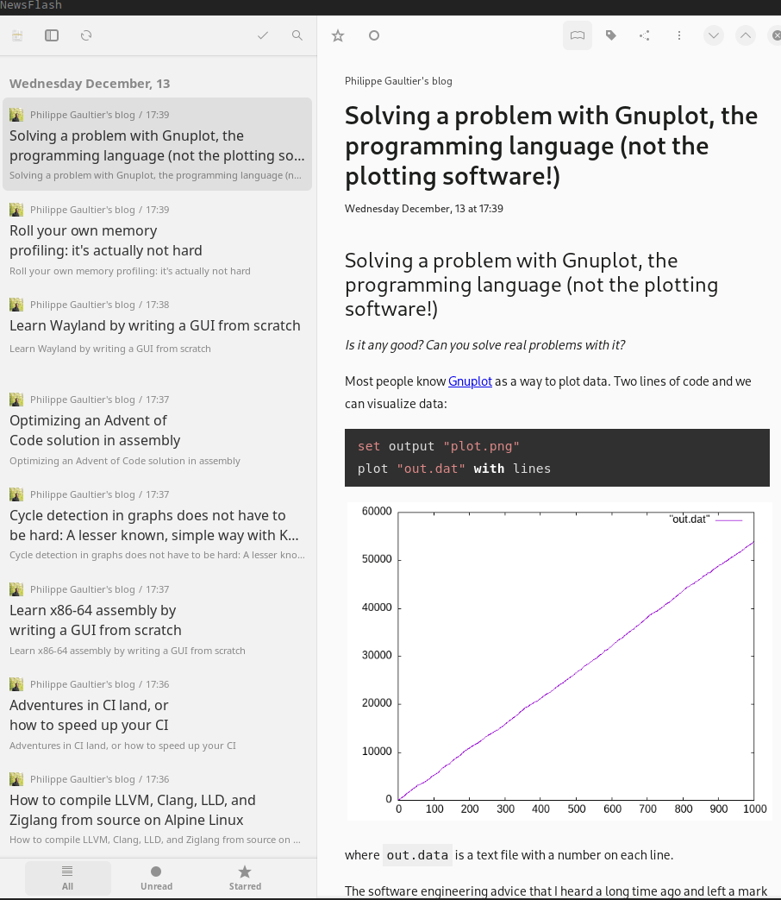

<!DOCTYPE html>
<html>
<head>
<meta charset="utf-8">
<link rel="shortcut icon" type="image/ico" href="/blog/favicon.ico"/>
<link rel="stylesheet" type="text/css" href="main.css">
<link rel="stylesheet" href="https://unpkg.com/@highlightjs/cdn-assets@11.8.0/styles/default.min.css">

</head>
<body>

    <a id="name" href="/blog"> Philippe Gaultier </a>
    <ul>
      <li>
      <a href="/blog/feed.xml">Feed</a>
      </li>
      <li>
      <a href="https://www.linkedin.com/in/philippegaultier/">LinkedIn</a>
      </li>
      <li>
        <a href="https://github.com/gaultier">Github</a>
      </li>
    </ul>

# This blog now has an Atom feed

*Find it [here](https://gaultier.github.io/blog/feed.xml) or in the header on the top right-hand corner.*

Imagine a world where you can see the content of each website you like inside the app of your choosing, be notified whenever the website has something new, and all of which is implemented with an open standard. Well that was most of the web some years ago and this blog now does all of that. 

And it's not hard! The only thing we need is to serve a `feed.xml` file that lists articles with some metadata such as 'updated at' and a UUID to be able to uniquely identify an article. This XML file is an [Atom feed](https://en.wikipedia.org/wiki/Atom_(web_standard)) which has a nice [RFC](https://datatracker.ietf.org/doc/html/rfc4287).

I implemented that in under an hour, skimming at the RFC and examples, and the script to do so is [here](https://github.com/gaultier/blog/blob/master/feed.go). And you can do too! Again, it's not hard. Here goes:

- We pick a UUID for our feed. I just generated one and sticked it as a constant in the script.
- The 'updated at' field for the feed is just `time.Now()`. It's not exactly accurate, it should probably be the most recent `mtime` across articles but it's good enough.
- For each article (`*.html`) file in the directory, we add an entry (`<entry>`) in the XML document with:
  * The link to the article, that's just the filename in my case.
  * The 'updated at' field, which is just the `mtime` of the file locally
  * A UUID. Here I went with UUIDv5 which is simply the sha1 of the file name in the UUID format. It's nitfy because it means that the script is stateless and idempotent. If the article is later updated, the UUID remains the same (but the `updated at` will still hint at the update).
  * The content, as HTML, simply embedded as is inside the document

And...that's it really. Enjoy reading these articles in your favorite app!

</body>
</html>
