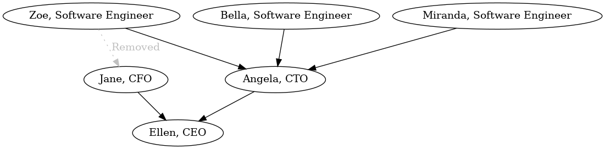

<link rel="stylesheet" type="text/css" href="main.css">
<link rel="stylesheet" href="https://unpkg.com/@highlightjs/cdn-assets@11.8.0/styles/default.min.css">
<script src="https://unpkg.com/@highlightjs/cdn-assets@11.8.0/highlight.min.js"></script>
<script>
window.addEventListener("load", (event) => {
  hljs.highlightAll();
});
</script>

# A lesser known, simple way to find cycles in a graph: Kahn's algorithm

Graphs are everywhere in Software Engineering, or so we are told by Computer Science teachers and interviewers.

Not too long ago, I was tasked to create a Web API to create and update a company's hierarchy of employee, and display that on a web page. Basically, who reports to whom.

In the simple case, it's a tree, when an employee reports to exactly one manager. But there are more complex cases of companies where an employee reports to multiple managers and that creates a graph.


Here's the graph of employees in an organization. An employee reports to one or more managers, and this forms a graph. The root of the graph is the CEO since they report to no one and so there have no incoming edge:
An arrow (or 'edge') between two nodes means `<source> reports to <destination>`, for example: `Jane the CFO reports to Ellen the CEO`.

In our problem, cycles are forbidden and we have to detect them and reject such graphs.

## SQL 

So how do we store all of those people in the database?

```sql
CREATE TABLE IF NOT EXISTS people(name TEXT NOT NULL UNIQUE, manager BIGINT REFERENCES people)
```

Each employee has a optional reference to a manager. 

For example, to save `Ellen, CEO` inside the database, we do:

```sql
INSERT INTO people VALUES('Ellen, CEO', NULL)
```

And to save `Jane, CFO` in the database:

```sql
INSERT INTO people VALUES('Jane, CFO', 1)
```

assuming `Ellen, CEO`, Jane's boss, has the id `1`.

Immediately, we notice that to insert an employee, their manager needs to already by in the database, by virtue of the self-referential foreign key `manager BIGINT REFERENCES people`.

So we need a way to sort the big list of `employee -> manager` links (or 'edges' in graph parlance), to insert them in the right order. First we insert the CEO, who reports to no one. Then we insert the employees directly reporting to the CEO. Then the employees reporting to those. Etc.

And that's called a topological sort.

## Topological sort

From Wikipedia:

> A topological sort or topological ordering of a directed graph is a linear ordering of its vertices such that for every directed edge uv from vertex u to vertex v, u comes before v in the ordering. For instance, the vertices of the graph may represent tasks to be performed, and the edges may represent constraints that one task must be performed before another; in this application, a topological ordering is just a valid sequence for the tasks

That's a mouthful but it's not too hard. 

A good command line utility that's already on your (Unix) machine is `tsort`, which takes a list of edges as input, and outputs a topological sort. Here is the input in a text file (`people.txt`):

```
Jane Ellen
Angela Ellen
Zoe Jane
Zoe Angela
Bella Angela
Miranda Angela
```

> `tsort` uses a simple way of defining each edge `A -> B` on its own line with the syntax: `A B`. The order of the lines does not matter.

and here's the tsort output:

```sh
$ tsort < people.txt
Bella
Miranda
Zoe
Angela
Jane
Ellen
```

The first 3 elements are the ones with no incoming edge, the Software Engineers, since no one reports to them. Then come their repective managers, Angela and Jane. Finally comes their manager, `Ellen`.

So to insert all those people in our `people` SQL table, we go through that list in reverse order: We can first insert `Ellen`, then `Jane`, etc, until we finally insert `Bella`.

Also, `tsort` detects cycles, for example if we add the line: `Ellen Zoe` at the end of `people.txt`, we get:

```sh
$ tsort < people.txt
Bella
Miranda
tsort: -: input contains a loop:
tsort: Jane
tsort: Ellen
tsort: Zoe
Jane
tsort: -: input contains a loop:
tsort: Angela
tsort: Ellen
tsort: Zoe
Angela
Ellen
Zoe
```

So, how can we implement something like `tsort` for our problem at hand? That's where [Kahn's algorithm](https://en.wikipedia.org/wiki/Topological_sorting#Kahn's_algorithm) comes in to do exactly that: find cycles in the graph and output a topological sort.

*Note that that's not the only solution and there ways to detect cycles without creating a topological sort, but this algorithm seems relatively unknown and does not come up often on the Internet, so let's discover how it works and implement it. I promise, it's not complex.*

## How to store the graph in memory

There are many ways to do so, and Kahn's algorithm does not dictate which one to use. 

We'll use an [adjacency matrix](https://en.wikipedia.org/wiki/Adjacency_matrix), because it's simple conceptually, maps well to Kahn's algorithm, and can be optimized if needed. 

It's just a 2D square table of size `n x n` (where `n` is the number of nodes), where the cell at row `i` and column `j` is 1 if there is an edge from the node `i` to the node `j`, and otherwise, `0`. 

The order of the nodes is arbitrary, I'll use the alphabetical order because again, it's simple to do:

```
Angela
Bella
Ellen
Jane
Miranda
Zoe
```

Here, `Angela` is the node `0` and `Zoe` is the node `5`.

Since there is an edge from `Zoe` to `Angela`, i.e. from the node `5` to the node `0`, the cell at the position `(5, 0)` is set to `1`.


The full adjacency matrix for the employee graph in the example above looks like:

<table>
  <tbody>
    <tr> <th></th>        <th>Angela</th>  <th>Bella</th>  <th>Ellen</th> <th>Jane</th>  <th>Miranda</th> <th>Zoe</th>  </tr>
    <tr> <td>Angela</td>  <td>0</td>       <td>0</td>      <td>1</td>     <td>0</td>     <td>0</td>       <td>0</td>    </tr>
    <tr> <td>Bella</td>   <td>1</td>       <td>0</td>      <td>0</td>     <td>0</td>     <td>0</td>       <td>0</td>    </tr>
    <tr> <td>Ellen</td>   <td>0</td>       <td>0</td>      <td>0</td>     <td>0</td>     <td>0</td>       <td>0</td>    </tr>
    <tr> <td>Jane</td>    <td>0</td>       <td>0</td>      <td>1</td>     <td>0</td>     <td>0</td>       <td>0</td>    </tr>
    <tr> <td>Miranda</td> <td>1</td>       <td>0</td>      <td>0</td>     <td>0</td>     <td>0</td>       <td>0</td>    </tr>
    <tr> <td>Zoe</td>     <td>1</td>       <td>0</td>      <td>0</td>     <td>1</td>     <td>0</td>       <td>0</td>    </tr>
  </tbody>
</table>

The way to read this table is:

- For a given row, all the `1` indicate outgoing edges
- For a given column, all the `1` indicate incoming edges
- If there is a `1` on the diagonal, it means there is an edge going out of a node and going to the same node.

There are a lot of zeroes in this table, in the case of a Directed Acyclic Graph (DAG), which is our case. Some may think this is horribly inefficient, which it is, but it really depends on number of nodes, i.e. the number of employees in the organization. 
But note that this adjacency matrix is a concept, it shows what information is present, but not how it is stored.

For this article, we will store it the naive way, in a 2D array. Here are two optimization ideas I considered but have not had time to experiment with:

- Make this a bitarray. We are already only storing zeroes and ones, so it maps perfectly to this format.
- Since there are a ton of zeroes, it is very compressable. An easy way would be to use run-length encoding, meaning, instead of `0 0 0 0`, we just store the number of times the number occurs: `4 0`. Easy to implement, easy to understand. Its efficiency depends on the situation but we expect few outgoing edges (an employee reports to one, or a few, managers, not to 100+), so a row would compress well, probably just a few bytes.

Wikipedia lists others if you are interested, it's a well-known problem.


Alright, now that we know how our graph is represented, on to the algorithm.

## Kahn's algorithm


Kahn's algorithm operates on 'the set of all nodes with no incoming edge', and mutates the graph (in our case the adjacency matrix), by removing one edge at a time, until there are no more edges, and builds a list of nodes in the right order. 

Here's the pseudo-code:

```
 1│ L ← Empty list that will contain the sorted elements
 2│ S ← Set of all nodes with no incoming edge
 3│ 
 4│ while S is not empty do
 5│     remove a node n from S
 6│     add n to L
 7│     for each node m with an edge e from n to m do
 8│         remove edge e from the graph
 9│         if m has no other incoming edges then
10│             insert m into S
11│ 
12│ if graph has edges then
13│     return error   (graph has at least one cycle)
14│ else 
15│     return L   (a topologically sorted order)
```

And in plain english:

`Line 1`: The result of this algorithm is the list of nodes in the desired order (topological). It starts empty, and we add nodes one-by one during the algorithm. We can simply use an array in our implementation.

`Line 2`: We first collect all nodes with no incoming edge. In terms of adjacency matrix, it means picking columns with only zeroes. The algorithm calls it a set, but we are free in our implementation to use whatever data structure we see fit. It just means a given node appears at most once in it. In our example, this set is: `[Zoe, Bella, Miranda]`. During the algorithm course, we will add further nodes to this set. Note that this is a working set, not the final result. Also, the order does not matter.

`Line 4`: Self-explanatory, we continue until the working set is empty and there is no more work to do.

`Line 5`: We first pick a node with no incoming edge (it does not matter which one). For example, `Zoe`, and remove it from `S`. `S` is now: `[Bella, Miranda]`.

`Line 6`: We add this node to the list of topologically sorted nodes, `L`. It now is: `[Zoe]`.

`Line 7`: We then inspect each node that `Zoe` has an edge to. That means `Jane` and `Angela`. In terms of adjacency matrix, we simply read `Zoe's` row, and inspect cells with a `1` in it.

`Line 8`: We remove such an edge, for example, `Zoe -> Jane`. In terms of adjacency matrix, it means setting the cell on the row `Zoe` and column `Jane` to `0`.

At this point, the graph looks like this:



`Line 9`: If `Jane` does not have another incoming edge, we add it to the set of all nodes with no incoming edge. That's the case here, so `S` now looks like: `[Bella, Miranda, Jane]`.

We know loop to `Line 7` and handle the node `Angela` since `Jane` is taken care of.


`Line 12-15`: Once the loop at `Line 4` is finished, we inspect our graph. If there are no more edges, we are done. If there is still an edge, it means there was a cycle in the graph, and we return an error.
Note that this algorithm is not capable by itself to point out which cycle there was exactly, only that there was one. That's because we mutated the graph by removing edges. If this information was important, we could keep track of which edges we removed in order, and re-add them back, or perhaps apply the algorithm to a copy of the graph (the adjacency matrix is trivial to clone).


This algorithm is loose concerning the order of some operations, for example, picking a node with no incoming edge, or in which order the nodes in `S` are stored. That gives room for an implementation to use certain datastructures or orders that are faster, but in some cases we want the order to be always the same to solve ties in the stable way and to be reproducible. In order to do that, we simply use the alphabetical order. So in our example above, at `Line 5`, we picked `Zoe` out of `[Zoe, Bella, Miranda]`. Using this method, we would keep the working set `S` sorted alphabetically and pick `Bella` out of `[Bella, Miranda, Zoe]`.


## Implementation

I implemented this at the time in `Go`, but I will use for this article the lingua franca of the 2010s, Javascript.


First, we define our adjacency matrix and the list of nodes. This is the naive format. We would get the nodes and edges in some format, for example JSON, in the API, and build the adjacency matrix, which is trivial.

```js
const adjacencyMatrix = [
  [0, 0, 1, 0, 0, 0],
  [1, 0, 0, 0, 0, 0],
  [0, 0, 0, 0, 0, 0],
  [0, 0, 1, 0, 0, 0],
  [1, 0, 0, 0, 0, 0],
  [1, 0, 0, 1, 0, 0],
];

const nodes = ["Angela", "Bella", "Ellen", "Miranda", "Zoe"];
```

First, we need a helper function to check if a node has no incoming edge (`Line 9` in the algorithm):

```js
function hasNodeNoIncomingEdge(adjacencyMatrix, nodes, nodeIndex) {
  const column = nodeIndex;

  for (row = 0; row < nodes.length; row += 1) {
    const cell = adjacencyMatrix[row][column];

    if (cell != 0) {
      return false;
    }
  }

  return true;
}
```

Then, using this helper, we can define a second helper to initially collect all the nodes with no incoming edge:

```js
function getNodesWithNoIncomingEdge(adjacencyMatrix, nodes) {
  const result = [];

  for (column = 0; column < nodes.length; column += 1) {
    if (hasNodeNoIncomingEdge(adjacencyMatrix, nodes, column)) {
      const node = nodes[column];
      result.push(node);
    }
  }

  return result;
}
```

We can try it:

```js
console.log(getNodesWithNoIncomingEdge(adjacencyMatrix, nodes));
```

And it outputs: 

```js
[ 'Bella', 'Miranda', 'Zoe' ]
```
