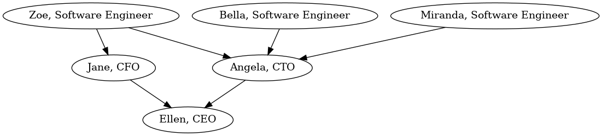

<link rel="stylesheet" type="text/css" href="main.css">

# A lesser known, simple way to find cycles in a graph: Kahn's algorithm

Graphs are everywhere in Software Engineering, or so we are told by Computer Science teachers and interviewers.

Not too long ago, I was tasked to create a Web API to create and update a company's hierarchy of employee, and display that on a web page. Basically, who reports to whom.

In the simple case, it's a tree, when an employee reports to exactly one manager. But there are more complex cases of companies where an employee reports to multiple managers and that creates a graph.



Here's the graph of employees in an organization. An employee reports to one or more managers, and this forms a graph. The root of the graph is the CEO since they report to no one and so there have no incoming edge:
An arrow (or 'edge') between two nodes means `<source> reports to <destination>`, for example: `Jane the CFO reports to Ellen the CEO`.

## SQL 

So how do we store all of those people in the database?

```sql
CREATE TABLE IF NOT EXISTS people(name TEXT NOT NULL UNIQUE, manager BIGINT REFERENCES people)
```

Each employee has a optional reference to a manager. 

For example, to save `Ellen, CEO` inside the database, we do:

```sql
INSERT INTO people VALUES('Ellen, CEO', NULL)
```

And to save `Jane, CFO` in the database:

```sql
INSERT INTO people VALUES('Jane, CFO', 1)
```

assuming `Ellen, CEO`, Jane's boss, has the id `1`.

Immediately, we notice that to insert an employee, their manager needs to already by in the database, by virtue of the self-referential foreign key `manager BIGINT REFERENCES people`.

So we need a way to sort the big list of `employee -> manager` links (or 'edges' in graph parlance), to insert them in the right order. First we insert the CEO, who reports to no one. Then we insert the employees directly reporting to the CEO. Then the employees reporting to those. Etc.

And that's called a topological sort.

## Topological sort

From Wikipedia:

> A topological sort or topological ordering of a directed graph is a linear ordering of its vertices such that for every directed edge uv from vertex u to vertex v, u comes before v in the ordering. For instance, the vertices of the graph may represent tasks to be performed, and the edges may represent constraints that one task must be performed before another; in this application, a topological ordering is just a valid sequence for the tasks

That's a mouthful but it's not too hard. 

A good command line utility that's already on your (Unix) machine is `tsort`, which takes a list of edges as input, and outputs a topological sort. Here is the input in a text file (`people.txt`):

```
Jane Ellen
Angela Ellen
Zoe Jane
Zoe Angela
Bella Angela
Miranda Angela
```

> `tsort` uses a simple way of defining each edge `A -> B` on its own line with the syntax: `A B`. The order of the lines does not matter.

and here's the tsort output:

```sh
$ tsort < people.txt
Bella
Miranda
Zoe
Angela
Jane
Ellen
```

The first 3 elements are the ones with no incoming edge, the Software Engineers, since no one reports to them. Then come their repective managers, Angela and Jane. Finally comes their manager, Ellen.

So to insert all those people in our `people` SQL table, we go through that list in reverse order: We can first insert `Ellan`, then `Jane`, etc, until we finally insert `Bella`.

Also, `tsort` detects cycles, for example if we add the line: `Ellen Zoe` at the end of `people.txt`, we get:

```sh
$ tsort < people.txt
Bella
Miranda
tsort: -: input contains a loop:
tsort: Jane
tsort: Ellen
tsort: Zoe
Jane
tsort: -: input contains a loop:
tsort: Angela
tsort: Ellen
tsort: Zoe
Angela
Ellen
Zoe
```

So, how can we implement something like `tsort` for our problem at hand? That's where Kahn's algorithm comes in to do exactly that: find cycles in the graph and output a topological sort.

*Note that that's not the only solution and there ways to detect cycles without creating a topological sort, but this algorithm seems relatively unknown and does not come up often on the Internet, so let's discover how it works and implement it. I promise, it's not complex.*
