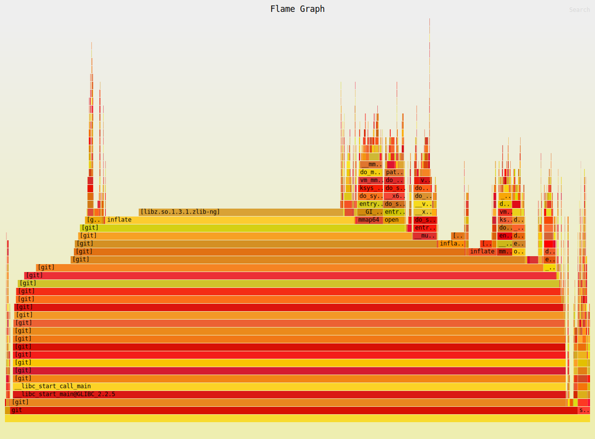

Title: Making my static blog generator 11 times faster
Tags: Optimization, Git, Odin
---

In the early days of this blog, there were only a few articles, and the build process was a simple makefile, something like this (simplified):

```make
%.html: %.md header.html footer.html
        cat header.html >> $@
        pandoc --toc $< >> $@
        cat footer.html >> $@
```

For each markdown file, say `do_not_use_design_patterns.md`, we transform the markdown into HTML (at the time with `pandoc`, now with `cmark`) and save that in a file `do_not_use_design_patterns.html`, with a HTML header and footer.


Later I added the publication date:

```make
%.html: %.md header.html footer.html
        cat header.html >> $@
        printf '<p id="publication_date">Published on %s.</p>\n' $$(git log --format='%as' --reverse -- $< | head -n1)  >> $@; fi
        pandoc --toc $< >> $@
        cat footer.html >> $@
```

The publication date is the creation date, that is: the date of the first Git commit for this file. So we ask Git for the list of commits for this file (they are provided by default from newest to oldest, so we `--reverse` the list), take the first one with `head`, done. It's simple.

*Note: My initial approach was to get the creation and modification date from the file system, but it's incorrect, as soon as you work on more than one machine. The way Git works is that when you pull commits that created a file, it creates the file and does not try to hack the creation date. Thus the file creation date is the time of the Git pull, not the date of the commit that first created it.*

As I added more and more features to this blog, like a list of article by tags, a home page that automatically lists all of the articles, a RSS feed, the 'last modified' date for an article, etc, I outgrew the makefile approach and wrote a small [program](https://github.com/gaultier/blog/blob/master/src/main.odin) (initially in Zig, then in Odin) to do all that. But the core approach remained: 

- List all markdown files in the current directory (i.e. `ls *.md`, make does that for us with `%.md`) 
- For each markdown file, sequentially:
  + Run `git log ... article.md` to get the first and last commit date (respectively 'created at' and 'modified at') 
  + Convert the markdown content to HTML
  + Save this HTML to `article.html`

For long time, it was all good. It was single-threaded, but plenty fast. So I wrote more and more articles. But a few days ago, I noticed that it was getting a bit slow...Just enough for me to wait during the edit-view cycle:

```sh
 $ hyperfine --warmup 2 ./master.bin 
Benchmark 1: ./master.bin
  Time (mean ± σ):      1.873 s ±  0.053 s    [User: 1.351 s, System: 0.486 s]
  Range (min … max):    1.806 s …  1.983 s    10 runs
```

~ 2 seconds is not the end of the world, but it's just enough to be annoying. So what's going on? Let's profile it:



Yeah...I think doing `git log` for each article, sequentially, might not be such a good idea. 

At this point it's important to mention that this program is a very simplistic static site generator: it is stateless and processes every markdown file in the repository. You could say that it's a regression compared to the Makefile. But in reality, I was most of the time forcing a clean build with `make -B` because I tweaked something in the logic that applies to every file (for example, I tweaked the wording in the `Donate` section at the end of each article ;) ) and every single file should anyway be regenerated.
Also, I like this 'pure function' approach. There is no caching issue to debug, no complicated code to write, etc. Perhaps I will revisit this at a later point; but as long as the simple approach works fast enough, it's good enough for me.

So I had to do something about it, because it was going to become slower and slower with each new article. My target was to do the whole thing in 1s, or possibly even 0.5s.

I could see a few options:

- Do not block on `git log`. We can use a thread pool, or a [asynchronous approach](/blog/way_too_many_ways_to_wait_for_a_child_process_with_a_timeout.html) to spawn all the git processes at once, and wait for all of them to finish.
- Make `git log` faster
- Implement caching so that only the changed markdown files get regenerated.

The last option was my preferred one because it did not force me to re-architect the whole program.

## When there's one, there's many

My intuition was to do a deep dive in the `git log` options, to see if I could instruct it to do less work. But then something struck me: we invoke `git log` to get all commits for one markdown file (even though we only are interested in the first and last, but that's all what Git provides us). What if we invoked it once *for all markdown files*? Yes, the output might be a bit big... Let's try! 

Conceptually we can simply do `git log '*.md'` and parse the output. We can refine that approach later, but that's the gist of it.

Let's see if that's feasible:

```sh
 $ time git log '*.md' | wc -c
191196

________________________________________________________
Executed in   73.69 millis    fish           external
   usr time   61.04 millis  738.00 micros   60.30 millis
   sys time   15.95 millis  191.00 micros   15.76 millis
```

So it's much faster than doing it per file, and also it's entire output is ~ 186 KiB. And these numbers should grow very slowly because each new commit only adds ~ 100 bytes to the output.

Looks like we got our solution.

Mike Acton and Data Oriented Design are right once again:


*Or: try to think in terms of arrays, not in terms of one isolated object at a time.*


## The new implementation

We only want for each commit: 

- The date
- Which files were affected

Hence we pass to `git log`:

- `--format='%aI'` to get the date in ISO format
- `--name-status` to know which files this commit added (`A`), modified (`M`), deleted (`D`), or renamed (`R`)
- `--no-merges` to skip merge commits since they do not directly affect any file
- `--diff-filter=AMRD` to only get commits that add/modify/delete/rename files. We are not interested in commits changing the mode of a file, or symlinks, etc.

With these options we get even better numbers:

```sh
$ time git log --format='%aI' --name-status --no-merges --diff-filter=AMDR  -- '*.md' | wc -c
77832

________________________________________________________
Executed in  108.38 millis    fish           external
   usr time   83.70 millis  231.00 micros   83.47 millis
   sys time   27.99 millis  786.00 micros   27.20 millis
```


The output looks like this (I annotated each part along with the commit number):

```
2024-11-05T15:43:44+01:00                                                               | [1] A commit starts with the date.
                                                                                        | [1] Empty line
M       how_to_rewrite_a_cpp_codebase_successfully.md                                   | [1] A list of 1 or more files affected by this commit.
M       write_a_video_game_from_scratch_like_1987.md                                    | [1] It starts with a letter describing the action.
M       x11_x64.md                                                                      | [1] Here it's all modifications.
M       you_inherited_a_legacy_cpp_codebase_now_what.md                                 | [1]
2025-02-02T22:54:23+01:00                                                               | [2] The second entry starts.
                                                                                        | [2] 
R100    cross-platform-timers.md        the_missing_cross_platform_api_for_timers.md    | [2] Rename followed by the confidence score (which we do not care about).
[...]                                                                                   | Etc.
```


Parsing this commit log is tedious but not extremely difficult (why doesn't every mainstream command line tool have a `--json` option in 2025?).

We maintain a map while inspecting each commit: `map<Path, (creation_date, modification_date, tombstone)>`. 

In case of a rename or delete, we set the `tombstone` to `true`. Why not remove the entry from the map directly? Well, we are inspecting the list of commits from newest to oldest.

So first we'll encounter the delete/rename commit, and then a number of add/modify commits for this file. When we are done, we need to remember that this markdown file should be ignored, otherwise, we'll try to open it, read it, and convert it to HTML, but we'll get a `ENOENT` error. We could not maintain a tombstone and just bail on `ENOENT`, that's a matter of taste I guess.

<details>
  <summary>Odin implementation</summary>

```odin
GitStat :: struct {
	creation_date:     string,
	modification_date: string,
	path_rel:          string,
	tombstone:         bool,
}

get_articles_creation_and_modification_date :: proc() -> ([]GitStat, os2.Error) {
	free_all(context.temp_allocator)
	defer free_all(context.temp_allocator)

	state, stdout_bin, stderr_bin, err := os2.process_exec(
		{
			command = []string {
				"git",
				"log",
				// Print the date in ISO format.
				"--format='%aI'",
				// Ignore merge commits since they do not carry useful information.
				"--no-merges",
				// Only interested in creation, modification, renaming, deletion.
				"--diff-filter=AMRD",
				// Show which modification took place:
				// A: added, M: modified, RXXX: renamed (with percentage score), etc.
				"--name-status",
				"*.md",
			},
		},
		context.temp_allocator,
	)
	if err != nil {
		fmt.eprintf("git failed: %d %v %s", state, err, string(stderr_bin))
		panic("git failed")
	}

	stdout := strings.trim_space(string(stdout_bin))
	assert(stdout != "")

	stats_by_path := make(map[string]GitStat, allocator = context.temp_allocator)

	// Sample git output:
	// 2024-10-31T16:09:02+01:00
	// 
	// M       lessons_learned_from_a_successful_rust_rewrite.md
	// A       tip_of_day_3.md
	// 2025-02-18T08:07:55+01:00
	//
	// R100    sha.md  making_my_debug_build_run_100_times_faster.md

	// For each commit.
	for {
		// Date
		date: string
		{
			line := strings.split_lines_iterator(&stdout) or_break

			assert(strings.starts_with(line, "'20"))
			line_without_quotes := line[1:len(line) - 1]
			date = strings.clone(strings.trim(line_without_quotes, "' \n"))
		}

		// Empty line
		{
			// Peek.
			line, ok := strings.split_lines_iterator(&stdout)
			assert(ok)
			assert(line == "")
		}

		// Files.
		for {
			// Start of a new commit?
			if strings.starts_with(stdout, "'20") do break

			line := strings.split_lines_iterator(&stdout) or_break
			assert(line != "")

			action := line[0]
			assert(action == 'A' || action == 'M' || action == 'R' || action == 'D')

			old_path: string
			new_path: string
			{
				// Skip the 'action' part.
				_, ok := strings.split_iterator(&line, "\t")
				assert(ok)

				old_path, ok = strings.split_iterator(&line, "\t")
				assert(ok)
				assert(old_path != "")

				if action == 'R' { 	// Rename has two operands.
					new_path, ok = strings.split_iterator(&line, "\t")
					assert(ok)
					assert(new_path != "")
				} else { 	// The others have only one.
					new_path = old_path
				}
			}

			{
				git_stat, present := &stats_by_path[new_path]
				if !present {
					stats_by_path[new_path] = GitStat {
						// In 99% of the cases, it's *not* a rename and thus the `new_path` should be used.
						path_rel          = new_path,
						// We inspect commits from newest to oldest so the first commit for a file is the newest i.e. the modification date.
						modification_date = date,
						creation_date     = date,
					}
				} else {
					assert(git_stat.path_rel != "")
					assert(git_stat.modification_date != "")
					// Keep updating the creation date, when we reach the end of the commit log, it has the right value.
					git_stat.creation_date = date
				}
			}

			// We handle the action separately from the fact that this is the first commit we see for the path.
			// Because a file could have only one commit which is a rename.
			// Or its first commit is a rename but then there additional commits to modify it. 
			// Case being: these two things are orthogonal.

			if action == 'R' {
				// Mark the old path as 'deleted'.
				stats_by_path[old_path] = GitStat {
					path_rel          = old_path,
					modification_date = date,
					tombstone         = true,
				}

				// The creation date of the new path is the date of the rename operation.
				(&stats_by_path[new_path]).creation_date = date
			}
			if action == 'D' {
				// Mark as 'deleted'.
				(&stats_by_path[new_path]).tombstone = true
			}
		}
	}

	git_stats := make([dynamic]GitStat)
	for _, v in stats_by_path {
		fmt.printf("%v\n", v)
		assert(v.path_rel != "")
		assert(v.creation_date != "")
		assert(v.modification_date != "")
		assert(v.creation_date <= v.modification_date)

		if !v.tombstone {
			append(
				&git_stats,
				GitStat {
					path_rel = strings.clone(v.path_rel),
					creation_date = strings.clone(v.creation_date),
					modification_date = strings.clone(v.modification_date),
				},
			)
		}
	}

	return git_stats[:], nil
}
```

</details

We can log what we parsed, for example only the articles that matter (tombstone == false):

```
GitStat{creation_date = "2023-10-12T13:19:53+02:00", modification_date = "2024-11-05T15:49:57+01:00", path_rel = "wayland_from_scratch.md", tombstone = false}
GitStat{creation_date = "2024-10-29T13:46:14+01:00", modification_date = "2024-10-31T16:20:34+01:00", path_rel = "tip_of_day_1.md", tombstone = false}
GitStat{creation_date = "2023-12-01T15:15:26+01:00", modification_date = "2024-11-04T09:24:17+01:00", path_rel = "gnuplot_lang.md", tombstone = false}
GitStat{creation_date = "2024-09-10T12:59:04+02:00", modification_date = "2024-09-12T12:14:42+02:00", path_rel = "odin_and_musl.md", tombstone = false}
GitStat{creation_date = "2024-11-10T23:58:59+01:00", modification_date = "2025-02-18T08:22:33+01:00", path_rel = "way_too_many_ways_to_wait_for_a_child_process_with_a_timeout.md", tombstone = false}
[...]
```

Alright, so how does our new implementation fare compared to the old one?

```sh
 $ hyperfine --warmup 2 './src-main.bin' './src.bin'
Benchmark 1: ./src-main.bin
  Time (mean ± σ):      1.773 s ±  0.022 s    [User: 1.267 s, System: 0.472 s]
  Range (min … max):    1.748 s …  1.816 s    10 runs
 
Benchmark 2: ./src.bin
  Time (mean ± σ):     158.7 ms ±   6.6 ms    [User: 128.4 ms, System: 133.7 ms]
  Range (min … max):   151.7 ms … 175.6 ms    18 runs
 
Summary
  ./src.bin ran
   11.17 ± 0.48 times faster than ./src-main.bin
```

Around 11 times faster, and well within our ideal target of 500 ms ! And all we had to do was convert many `git log` invocations (one per markdown file) to just one. Pretty simple change, located in one function. Almost all of the complexity is due to parsing Git custom text output and skipping over irrelevant commits. We don't really have a choice either: that's all Git provides to query the commit log. The alternatives are all worse:

- Parse directly the Git object files - no thank you
- Use a library (e.g. libgit2) and hope that offers a sane interface to query the commit log

I wonder if there is a better way...

## Fossil

[fossil](https://fossil-scm.org) is an alternative version control system created by the same folks that created, and are still working on, SQLite. Naturally, a fossil repository is basically just one SQLite database file. That sounds very *queryable*!

Let's import our git repository into a Fossil repository and entee the SQLite prompt:

```sh
$ git fast-export --all | fossil import --git new-repo.fossil
$ file new-repo.fossil 
new-repo.fossil: SQLite 3.x database (Fossil repository), [...]
$ fossil sql -R new-repo.fossil
```

There are lots of tables in this database. We craft this query after a few trials and errors (don't know if it is optimal or not):

```sql
sqlite> .mode json
sqlite> SELECT 
            f.name as filename,
            datetime(min(e.mtime)) as creation_date,
            datetime(max(e.mtime)) as last_modified
        FROM repository.filename f
        JOIN repository.mlink m ON f.fnid = m.fnid
        JOIN repository.event e ON m.mid = e.objid
        WHERE filename LIKE '%.md'
        GROUP BY f.name
        ORDER BY f.name;
```

Which outputs what we want:

```
[...]
{"filename":"body_of_work.md","creation_date":"2023-12-19 13:27:40","last_modified":"2024-11-05 15:11:55"},
{"filename":"communicate_by_sharing_code.md","creation_date":"2024-03-07 09:48:39","last_modified":"2024-03-07 10:14:09"},
{"filename":"compile_ziglang_from_source_on_alpine_2020_9.md","creation_date":"2020-09-07 18:49:20","last_modified":"2024-11-04 08:24:17"},
[...]
```

Note that this does not filter out deleted/removed files yet. I'm sure that it can be done by tweaking the query a bit, but there's not time! We need to measure it's running time!

```sh
$ hyperfine --shell=none 'fossil sql -R new-repo.fossil "SELECT [...]"'
Benchmark 1: fossil sql -R new-repo.fossil "[...]"
  Time (mean ± σ):       3.0 ms ±   0.5 ms    [User: 1.5 ms, System: 1.4 ms]
  Range (min … max):     2.2 ms …   5.6 ms    776 runs
```

Damn that's fast.

I do not use Fossil, but I eye it from time to time - generally when I need to extract some piece of information from Git and I discover it does not let me, or when I see the Gitlab bill  my (ex-) company pays, or when the Jira page takes more than 10 seconds to load... yeah, Fossil is the complete package, with issues, forums, a web UI, a timeline, a wiki, a chat... it has it all!

But the golden ticket idea is really to store everything inside SQLite. Suddenly, we can query anything! And there is no weird parsing needed - SQLite supports various export formats and (some? all?) fossil commands support the `--sql` option to show you which SQL query they use to get the information. After all, the only thing the `fossil` command line does in this case, is query the SQLite database!

It's quite magical to me that I can within a few seconds import my years-long git repository into a SQLite database and start querying it, and the performance is great.

## Conclusion

The issue was effectively a N+1 query problem. We issued a separate 'query' (in this case, `git log`) for each markdown file, in a sequential blocking fashion. This approach worked until it didn't because the number of entities (i.e. articles, and commits) grew over time. 

The solution is instead to do only one query for all entities. It may return a bit more data that we need, but that's much faster, and scales better, than the original version.

It's obvious in retrospect but it's easy to let it happen when the 'codebase' (a big word for only one source code file that started as a basic Makefile) is a few years old, it's only looked at briefly from time to time, and the initial implementation did not really allow for the correct approach - who wants to parse the `git log` output in the Makefile language? Furthermore, the initial approach was fine because it only looked at the creation date, so we could do `git log --reverse | head -n1` which is faster than sifting through the whole commit log. However, as it is always the case, requirements (again, a big word for my taste concerning what should my personal blog look like) change and the modification date had to also be extracted from git. This forced us, with the current Git functionality, to scan through the whole commit log, for each file, which became too slow.

As Mike Acton and Data Oriented Design state: 


It also does not help that any querying in Git is ad-hoc and outputs a weird text format that we have to tediously parse. Please output structured data, damn it! String programming is no fun at all.


