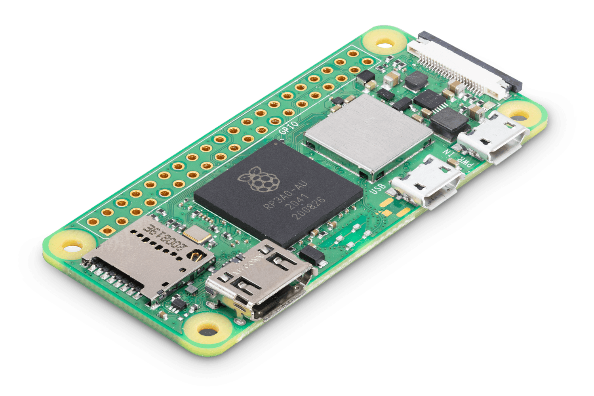

Title: Odin and musl: Cross-compiling Odin programs for the Raspberry Pi Zero
Tags: Odin, Musl, ARM, Cross-compilation
---

[Odin programming language](https://odin-lang.org/) is becoming my favorite tool as a Software Engineer. It's a fantastic programming language, mostly because it is dead simple.

I have purchased some time ago a Raspberry Pi Zero 2, and I found myself wanting to write command-line Odin programs for it. Here it is in all its beauty:



Here's the story of how I did it. If you do not work with Odin but do work a lot with cross-compilation, like I do at work, all of these techniques will be, I believe, very valuable anyway.

*Note: ARM64 is sometimes also called AARCH64 interchangeably.*
*Note 2: The Rapsberry Pi Zero 1 is based on ARM (32 bits). The Raspberry Pi Zero 2 is based on ARM64 (64 bits). If you have a Raspberry Pi Zero 1, this article still applies, just adjust the target when cross-compiling.*

## Inciting incident

The thing is, I work on an Intel Linux laptop and the Zero is a Linux ARM 64 bits piece of hardware. It's also a relatively cheap component with only 512 MiB of RAM and a slow CPU (compared to a modern developer workstation), and based on a very slow SD card, so it's not fast to install the required tools and to build source code on it. Cross-compilation is much easier and faster.

Odin can cross-compile to it with `-target=linux_arm64`, so that's great, let's try it:

```sh
$ odin build src -target=linux_arm64
[...]
/usr/bin/ld: /home/pg/my-code/odin-music-chords-placements/src.o: error adding symbols: file in wrong format
clang: error: linker command failed with exit code 1 (use -v to see invocation)
```

Oh no...The key part is: `file in wrong format`.

That's because behind the scenes, the Odin compiler builds our code into an ARM64 object file, which is great. But then it tries to link this object file with libc, which on this computer is a x86_64 library, and that won't work.

We can confirm this theory by asking Odin to print the linking command:

```sh
$ odin build src -target=linux_arm64 -print-linker-flags
clang -Wno-unused-command-line-argument [...]  -lm -lc   -L/       -no-pie
```
And we see it links libc with `-lc`, meaning it links our program with the local libc it finds on my machine which is a different architecture than our target.

## Confrontation

What we want is to link our object file with the correct libc, meaning one that has been built for ARM64. Moreover, we'd like to build our program statically with libc so that we can simply copy the one executable to the Raspberry Pi Zero and it is fully self-contained. We completely side-step issues of different glibc versions not being compatible with each other.

Enter musl, a C library for Linux that supports many platforms including ARM64, and static compilation. That's exactly what we need!

A big difference between Odin and Zig is that Zig is a full cross-compilation toolchain: it comes with the source code of `musl`, and has put in a ton of work to cross-compile it to the target the user desires. 

So to make our use-case work with Odin, without Odin the toolchain supporting what Zig supports, what we need to do is cross-compile our code to an ARM64 object file but without linking it yet. Then we link it manually to musl libc that has been built for ARM64. We could download this musl artifact from the internet but it's both more educational, empowering, and secure, to build it ourselves. So let's do this, it's not too much work.

To build musl, we can use clang since it is a cross-compiler by default, or we can use GCC by installing a GCC toolchain that has been made to target ARM64. Most Linux distributions provide such a compiler as a package typically called `gcc-aarch64-xxx` e.g. `sudo apt-get install gcc-aarch64-linux-gnu` or `sudo dnf install gcc-aarch64-linux-gnu`.

So let's now build a static musl for ARM64, following the official instructions. We just need to this once:

```sh
$ git clone --recurse --depth 1 https://git.musl-libc.org/git/musl
$ cd musl

# With Clang:
$ CFLAGS='--target=aarch64-unknown-linux-musl' RANLIB=llvm-ranlib AR=llvm-ar CC=clang ./configure --target=aarch64 --disable-shared
# Or with GCC:
$ RANLIB=/usr/bin/aarch64-linux-gnu-gcc-ranlib AR=/usr/bin/aarch64-linux-gnu-gcc-ar CC=/usr/bin/aarch64-linux-gnu-gcc ./configure --target=aarch64 --disable-shared

# Either way (Clang/GCC), the build command itself is the same.
$ make
```

We now have the two artifacts we want: `crt1.o` and `libc.a`. We can confirm that they have been correctly built for our target:

```sh
$ file lib/crt1.o
lib/crt1.o: ELF 64-bit LSB relocatable, ARM aarch64, version 1 (SYSV), not stripped
$ readelf -h lib/libc.a | grep '^\s*Machine:'
  Machine:                           AArch64
  Machine:                           AArch64
  Machine:                           AArch64
  [...]
```

## Resolution

Now we can finally put all the pieces together. We can use any linker, I am using LLD (the LLVM linker) here, but the GNU LD linker would also work as long as it knows to target ARM64 e.g. using the one coming with the right GCC toolchain would work.

```sh
$ odin build src  -target=linux_arm64 -build-mode=object
$ file src.o
src.o: ELF 64-bit LSB relocatable, ARM aarch64, version 1 (SYSV), not stripped
$ ld.lld main.o ~/not-my-code/musl/lib/libc.a ~/not-my-code/musl/lib/crt1.o
$ file a.out
a.out: ELF 64-bit LSB executable, ARM aarch64, version 1 (SYSV), statically linked, not stripped
```

Alternatively, we can decide to stick with the Odin compiler through and through, and we pass it the (lengthy) required build options:

```sh
$ odin build src -target=linux_arm64 -extra-linker-flags:'-L ~/not-my-code/musl/lib/ -nostdlib -fuse-ld=lld --target=linux-aarch64 ~/not-my-code/musl/lib/crt1.o -static'
```

We can even verify it works by running it inside a ARM64 Linux system using `qemu`:

```sh
$ qemu-aarch64-static a.out
# It runs!
```

Cherry on the cake, the resulting program is small:

```sh
$ llvm-strip a.out
$ du -h a.out 
288K	a.out
```

So it's a breeze to `scp` or `rsync` our small executable over to the Raspberry Pi Zero while hacking on it.

Perhaps Odin will have built-in support for musl in the future like Zig does. In the meantime, this article shows it's absolutely possible to do that ourselves!


## Appendix: Maybe you don't even need a libc

Odin comes with batteries included with a rich standard library. So why do we even need libc? Let's inspect which functions we really use from libc, i.e. are undefined symbols in the object file built from our source code:

```sh
$ nm -u src.o
                 U calloc
                 U free
                 U malloc
                 U memcpy
                 U memmove
                 U memset
                 U realloc
```

Ok, so basically: heap allocation and some functions to copy/set memory.

The former are not actually required if our program does not do heap allocations (Odin provides the option `-default-to-nil-allocator` for this case), or if we implement these ourselves, for example with a naive `mmap` implementation.

The latter are required even if we do not call them directly because typically, the compiler will replace some code patterns, e.g. `struct` or array initialization, with these functions behind the scene.

These `memxxx` functions could potentially be implemented by us, likely incurring a performance cost compared to the hand-optimized libc versions. But Odin can provide them for us! We can just use the `-no-crt` option.

Note that not all targets will be equally supported for this use-case and I also had to install `nasm` to make it work because Odin ships with some assembly files which are then built for the target with `nasm`, but Odin does not ship with `nasm` itself.

Let's try with a 'hello world' example:

```odin
package main

import "core:fmt"

main :: proc() {
	fmt.println("Hello")
}
```

We can build it as outlined like this:

```sh
$ odin build hello.odin -file -target=linux_amd64 -default-to-nil-allocator -no-crt
$ file hello
hello: ELF 64-bit LSB executable, x86-64, version 1 (SYSV), statically linked, BuildID[sha1]=ef8dfc9dc297295808f80ec66e92763358a598d1, not stripped
```

And we can see the `malloc` symbol is not present since we do opted out of it, and that Odin provided with these assembly files the correct implementation for `memset`:

```sh
$ nm hello | grep malloc
# Nothing
$ nm hello | grep memset
00000000004042c0 T memset
```


I'll soon write about what programs I made for the Raspberry Pi Zero, so check back soon!
