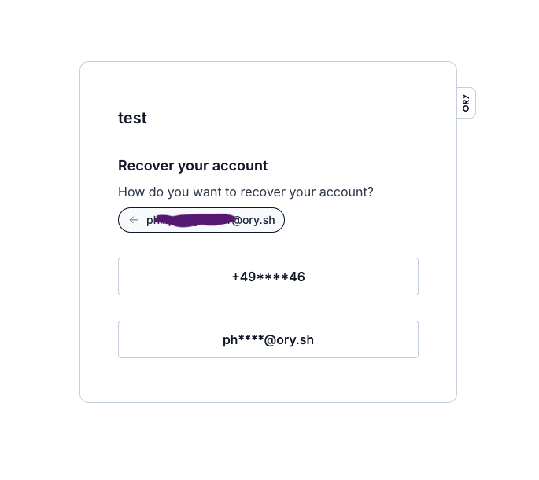
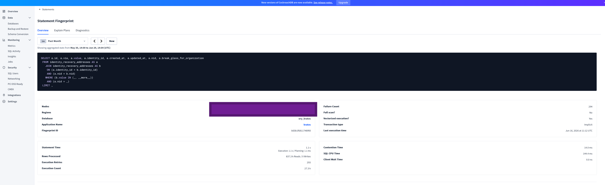
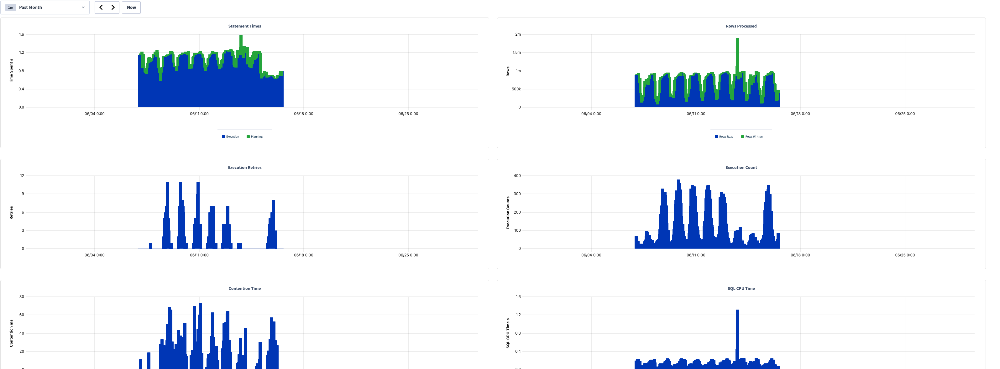
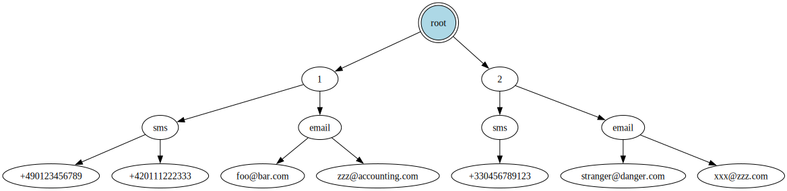
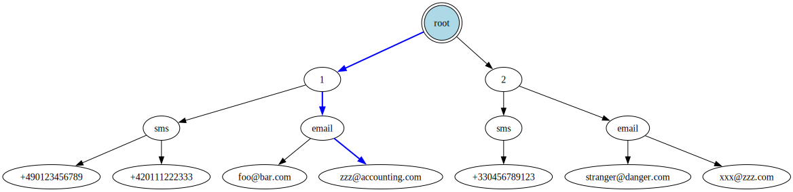
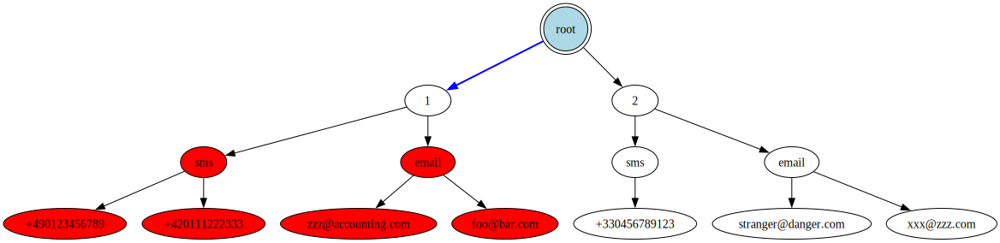
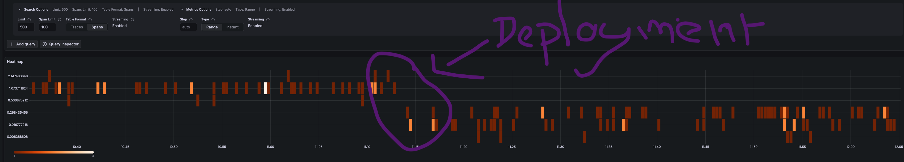

Title: Optimization tales with CockroachDB, part 1
Tags: SQL, Optimization, CockroachDB
---


It all started one morning. I opened Slack as usual to start my working day, only to find a message from the CTO:

> Hello this query reads like 700k rows

To which engineers replied:

> The plan looks ok IMHO, indices are being used:
>
> [copy pasted production plan]

And the CTO answering:

> This query should not read 700k rows, but like 10 or something.


And spoiler alert, he was dead right. I started to look into it and this turned out much more interesting than just 'it was a full table scan, I added the right index and moved on'.


As always, the code, and fix, are [open-source](https://github.com/ory/kratos/commit/c445e40e077ef5aeeedd6642830aba4fc6e36845)!

This query actually runs against all 4 databases we support (SQLite, PostgreSQL, MySQL, CockroachDB), but here I will focus on CockroachDB because that is the database that we run in production and because it has important differences, which make this investigation interesting.


*This is part 1, there will be more SQL optimization stories in the same vein.*

## The context

The software is [Kratos](https://github.com/ory/kratos), a widely used authentication and identity management service. Users of this software are humans. Humans often register with an email and password (Kratos also supports passwordless schemes such as passkeys, WebAuthn, etc, but the proverbial email+password approach remains very much in use). Humans also tend to forget their password. That's why Kratos like any identity management service worth its salt, supports password recovery. 

The user enters one of their addresses (email, phone number, etc), a list of their masked addresses is shown to them, they pick one, and a recovery link or code is sent to them on that address. Using that link or code, they can setup a new password. Pretty standard:




The table looks like this (showing only relevant fields):

```sql
CREATE TABLE public.identity_recovery_addresses (
    id UUID NOT NULL,
    via VARCHAR(16) NOT NULL,        -- 'email' or 'sms'
    value VARCHAR(400) NOT NULL,     -- 'foo@bar.com' or '+49123456789'
    identity_id UUID NOT NULL,       -- the identity (i.e. account) id
    nid UUID NULL,                   -- the tenant id

    CONSTRAINT identity_recovery_addresses_pkey PRIMARY KEY (identity_id ASC, id ASC),
    UNIQUE INDEX identity_recovery_addresses_status_via_uq_idx (nid ASC, via ASC, value ASC),
    UNIQUE INDEX identity_recovery_addresses_id_key (id ASC)
);
```


This is done with one SQL query (slightly simplified from the [real one](https://github.com/ory/kratos/commit/c445e40e077ef5aeeedd6642830aba4fc6e36845)):


```sql
SELECT *
FROM identity_recovery_addresses AS a
JOIN identity_recovery_addresses AS b
ON a.identity_id = b.identity_id
  AND a.nid = b.nid
WHERE b.value = ?
  AND a.nid = ?
LIMIT 10
```

*Kratos supports multi-tenancy, so each tenant has an id called `nid`, each row stores `nid`, and each query clause contains `WHERE nid = ?` to isolate each tenant. But this is a non factor: we know the tenant id from the start since each tenant has its own subdomain(s), so for this query, the `nid` is effectively a constant.*

The approach is relatively straightforward with a self-join, that can be understood as two queries:

1. Given the tenant id (`nid`) and the provided address, for example `foo@bar.com`, find the identity (i.e. the user account) for it.
2. Now that we have the identity id, find all addresses for that identity (`ON a.identity_id = b.identity_id`):
  ```sql
  SELECT *
  FROM identity_recovery_addresses AS a
  JOIN identity_recovery_addresses AS b
    ON a.identity_id = b.identity_id
    AND a.nid = b.nid
  WHERE b.value = 'foo@bar.com'
    AND a.nid = '000e377a-062c-45b1-961c-1b28d682df6a'
  LIMIT 10
  ```
3. Return the list of addresses for that identity, up to 10, because we do not expect a user to have more than a handful.

Now, Kratos can show the list of masked addresses e.g. `+15234****56` if it's a phone number, or `foo@****.com` if it's an email address. The masking logic is pretty smart so accidental information disclosure is avoided. Kratos also pretends to send the recovery link/code to a non-existing address, so that it's not possible for an attacker to probe a website for certain addresses. The last point can actually have real life consequences in certain countries for certain websites, e.g. LGBT ones. 

(Always remember that your code can impact lives).


Anyways, I am the one who actually wrote this query some months ago and I remember confirming in production that the query plan was sensical.

Now, the query is impacting the application and the database with its bad performance. It's not clear to me if:
- the performance was always subpar and no one noticed, or 
- some characteristics about the data in this table changed, which made the optimizer pick a different, worse plan, or
- the performance was originally okay, but the table grew over time and performance slowly deteriorated until it was unbearable


In any event: time to fix it.


## Investigation

### Statistics 

The CTO actually included in their original message a link to the SQL statement in the CockroachDB dashboard, which shows very surprising statistics:




| Metric | Value |
|---|---|
| Failure Count | 294 |
| Full scan? | No |
| Vectorized execution? | Yes |
| Transaction type | Implicit |
| Statement Time | 1.1 s (Execution: 1.1 s / Planning: 1.1 ms) |
| Rows Processed | 837.3 k Reads / 0 Writes |
| Execution Retries | 293 |
| Execution Count | 27.3 k |
| Contention Time | 14.0 ms |
| SQL CPU Time | 144.4 ms |





| Chart | Series | Approx. Peak | Notes |
|---|---|---|---|
| Statement Times | Execution + Planning | ~1.5 s | Mostly 1.0–1.3 s; activity ~06/07–06/15 |
| Rows Processed | Rows Read / Rows Written | ~2 m (spike) | Baseline ~0.5 m–1 m reads; one spike near 06/12 |
| Execution Retries | Retries | ~11 | Bursts of 4–11 between 06/07–06/15 |
| Execution Count | Execution Counts | ~380 | Periodic bursts, ~100–380 per interval |
| Contention Time | Contention (ms) | ~72 ms | Spiky, ranging ~20–72 ms |
| SQL CPU Time | CPU (s) | ~1.3 s (spike) | Baseline ~0.2–0.4 s |


Immediately the metrics that jump out to me (and did to my CTO) are:

- Rows read: 2 millions (peak). This is simply not tenable, as mentioned, we expect ~10. Due to the `LIMIT 10`, we are immediately throwing out 99.99% of the read rows, this is pure waste.
- SQL CPU time: 144ms. Normal queries take <1ms in CPU. This shows that a lot of rows are loaded in memory and processed somehow within the database. This is also not scalable and impacts all other queries in this database. The database should do very little CPU work!

The other metrics are interesting but less important at the moment. For example, there is a relatively large number of retries and contention time. They probably are a by-product of the millions of rows scanned. Since looking for all recovery addresses of one identity (i.e. user) scans (but does not return) unrelated rows, it creates unintentional, and unneeded, contention on these rows.


The next step is to inspect the plan being used in production using `EXPLAIN ANALYZE <query>`, or for even more details (specific to CockroachDB): `EXPLAIN ANALYZE (debug) <query>`.

### Query execution

*One thing to note first: this particular setup uses CockroachDB multi-region. That means the database has several nodes in multiple regions and rows are region aware, because the table is defined as `LOCALITY REGIONAL BY ROW`. However, the data for an identity is stored in one region.*

The first thing the query does is this:

```plaintext
 table: identity_recovery_addresses@identity_recovery_addresses_status_via_uq_idx  
 spans: [/'gcp-asia-northeast1'/'000e377a-062c-45b1-961c-1b28d682df6a' - /'gcp-asia-northeast1'/'000e377a-062c-45b1-961c-1b28d682df6a'] [/'gcp-europe-west3'/'000e377a-062c-45b1-961c-1b28d682df6a' - /'gcp-europe-west3'/'000e377a-062c-45b1-961c-1b28d682df6a'] [/'gcp-us-east4'/'000e377a-062c-45b1-961c-1b28d682df6a' - /'gcp-us-east4'/'000e377a-062c-45b1-961c-1b28d682df6a'] [/'gcp-us-west2'/'000e377a-062c-45b1-961c-1b28d682df6a' - /'gcp-us-west2'/'000e377a-062c-45b1-961c-1b28d682df6a']
```

We see that it is using the right index `identity_recovery_addresses_status_via_uq_idx (nid ASC, via ASC, value ASC)`. We notice that it fans-out to every region: Asia, Europe, US, etc. This is expected: we originally do not know in which region the identity is stored, so we have to ask every region in parallel.


But there is a problem. Can you spot it? Unless you are an advanced CockroachDB user, I'd be surprised if you do. I know I did not spot anything at first.


I'll explain the plan in layman's terms. This is what the query planner is doing, when a user enters `foo@bar.com` in the recovery screen:

1. Fan out to each region (this is fine and required). In each region:
    1. Find the row with the address `foo@bar.com` and tenant id `<nid>`. Due to how the index works, that actually means: Load all rows for this tenant in memory, then: Filter these rows in memory where the value is `foo@bar.com`. Throw out the rest.
    1. Now that we have found a matching row, we know the identity id. Find all rows with this identity id. This part is actually fast due to the primary key.

So each time a user wants to reset their password, we load all recovery addresses of all users for this tenant, in memory. That is really not great and becomes worse and worse over time. 

This explains the high latency and CPU usage!


### Why?


In CockroachDB, standard indexes are a tuple, e.g. `(nid, via, value)`. Conceptually, this is how the index looks like, with two tenants, `1` and `2`:





To use it the most efficiently, we specify all the fields, e.g.: `WHERE nid = '1' AND via = 'email' AND value = 'zzz@accounting.com'` (the order of the fields in the query actually does not matter, the optimizer will reorder them nicely). The database can then do a 'point lookup', meaning trace a path from the root of the index to a leaf (which points to a single row):





Only one row maximum is scanned, this is optimal. To be more precise: if the fields needed by the query are all stored in the index, no row is scanned, only the index data is used. Otherwise, the index is used to find the row id, and then the row data is scanned in the table, using the primary index. 

What happens then when only the first field in the tuple is provided, for example, only the `nid`? Well, the path in the index is very short, and all nodes underneath (the whole subtree, shown here in red) must be scanned and inspected:



This is what happens to us, and it is very wasteful.


But wait, we *do* provide more than the `nid`: we provide the address! In fact, that's the only thing the user provides! So how come it was not used, and all rows for the tenant were loaded? Well, there's more: the order of the fields in the tuple also matters. So for a tuple `(A, B, C)`, if we only provide `A` and `C`, it is as if (to over-simplify) we only provided `A`, and then we load every element underneath `A`. 


So here it is, the root cause: we did provide the first and third field in the tuple, but not the second one, `via`. 

So the query planner decided to use this index, this tuple of `(nid ASC, via ASC, value ASC)`, but it only knows the first value, `nid` (the tenant). So it can only eliminate rows from other tenants. For a tenant with many many users, performance is really bad. It's not quite a full table scan, but it's a full *tenant* table scan!


That's what the plan shows: `/'gcp-us-west2'/'000e377a-062c-45b1-961c-1b28d682df6a'` means: for each region, get (all of) the data from the tenant (`nid`) `000e377a-062c-45b1-961c-1b28d682df6a`. And no other field is used in the index!

### First optimization: provide 'via'

`via` is actually a derived value: given the user provided address `foo@bar.com` or `+49123456789`, we can trivially identify whether it is an email address or a phone number: if it contains the character `@`, it's an email address!


So let's add the `via` clause in the query:


```sql
SELECT *
 FROM identity_recovery_addresses AS a
   JOIN identity_recovery_addresses AS b
    ON a.identity_id = b.identity_id
    AND a.nid = b.nid
   WHERE b.value = 'foo@bar.com'
    AND b.via = 'email'  -- <= First optimization: Add `via`.
    AND a.nid = '000e377a-062c-45b1-961c-1b28d682df6a'
```

And now the plan looks *much* better, using the same index as before:


```plaintext
table: identity_recovery_addresses@identity_recovery_addresses_status_via_uq_idx
spans: [/'gcp-europe-west3'/'000e377a-062c-45b1-961c-1b28d682df6a'/'email'/'foo@bar.com' - /'gcp-europe-west3'/'000e377a-062c-45b1-961c-1b28d682df6a'/'email'/'foo@bar.com'] [/'gcp-us-east4'/'000e377a-062c-45b1-961c-1b28d682df6a'/'email'/'foo@bar.com' - /'gcp-us-east4'/'000e377a-062c-45b1-961c-1b28d682df6a'/'email'/'foo@bar.com'] [/'gcp-us-west2'/'000e377a-062c-45b1-961c-1b28d682df6a'/'email'/'foo@bar.com' - /'gcp-us-west2'/'000e377a-062c-45b1-961c-1b28d682df6a'/'email'/'foo@bar.com']
```

It's now a point lookup! We clearly see the full path from root to leaf: `/'gcp-us-west2'/'000e377a-062c-45b1-961c-1b28d682df6a'/'email'/'foo@bar.com'`, meaning for each region, we traverse the index using `nid` -> `via` -> `value`. And the plan even says for this first step: `actual row count: 1`. Perfect! Such a simple fix... If you know how multi-column indexes work in CockroachDB.


### Second optimization: single region


The self join can be understood as two queries: first, find the identity with the user-provided address. Second, find all addresses for this identity.

Only the first query truly needs to do a fan-out to all regions. Once we know the identity id, we know in which region it is. Since all the data for an identity is stored in one region, the second query does not need to talk to other regions at all! 
This is a big gain in terms of latency: at around 250ms network latency between distant regions, we can cut out one unneeded round-trip.

In CockroachDB, this is done by adding `crdb_region = ?` to the query `WHERE` or `JOIN` clause. Let's do that:

```sql
SELECT *
 FROM identity_recovery_addresses AS a
   JOIN identity_recovery_addresses AS b
    ON a.identity_id = b.identity_id
    AND a.nid = b.nid
    AND a.crdb_region = b.crdb_region -- <= Second optimization: Add `crdb_region`.
   WHERE b.value = 'foo@bar.com'
    AND b.via = 'email'  -- <= First optimization: Add `via`.
    AND a.nid = '000e377a-062c-45b1-961c-1b28d682df6a'
```

From the plan, we now see that the only time we fan-out to all regions is in the first step, afterwards, we stay within the same region. We also see that latency was cut by ~200 ms, as expected.


### Third optimization: only query needed columns


In the original query we fetched all table columns. But I then realized that we only ever need to fetch and return the `value` column (the address) because this is what gets returned to the user browser to let them pick which address to receive the recovery link/code on.

So this is a simple change:

```diff
- SELECT *
+ SELECT a.value
  FROM ...
```

I was mildly surprised to see no change in latency from that. After inspecting the plan and the table schema, this is for a simple reason: the index used in the last step of the query is the primary index. In CockroachDB (and some other databases: e.g. MySQL/InnoDB), the leaf in the primary index stores the whole row. So columns mentioned in the `SELECT` do not force an extra fetch.

However, some databases (e.g. PostgreSQL) work otherwise: the leaf in the primary index does *not* store the whole row, only the indexed columns, and selecting all columns *would* force an extra fetch, when a column is not part of the index. For these databases, we could add a new covering index to make it store the `value` column: `CREATE INDEX idx ON identity_recovery_addresses (identity_id) INCLUDE (value)` to avoid that final extra fetch.  This would make every `INSERT` a bit more costly because we have to store one extra field, so we would first need to judge if our workload is write-heavy or read-heavy to decide if the tradeoff is worth it.


Still, with this optimization, we:

- reduce the bytes sent over the network from the database to Kratos
- reduce the bytes sent over the network from Kratos to the user browser
- reduce slightly the marshalling/unmarshalling work
- avoid the risk that a big column is added to this table, which slows this query down (by fetching this data, and immediately throwing it away)

So even if it's a small win, it is still a win.


## Final results

Let's observe the latency of this query in production during the deployment of the fix:



It went from a consistent 1-2s to typically < 0.5s. All of the time is spent waiting on the network (due to cross-region latency).

More importantly, it completely disappeared from the top 10000 queries in terms of CPU time or rows scanned.


By revamping the indexes and being very multi-region aware, we could reduce the latency further, but it's already 'good enough'. See the conclusion for a discussion about what 'good enough' means.


Let's measure the final query in production in the worst case: a tenant that has 47 million recovery addresses, and we query from a different region (so that we have to pay for the cross-region latency): 

```plaintext
planning time: 2ms
execution time: 912ms
rows decoded from KV: 4 (406 B, 5 gRPC calls)
cumulative time spent in KV: 911ms
maximum memory usage: 140 KiB
sql cpu time: 337µs

Time: 1.180s total (execution 0.914s / network 0.265s)
```

Notice that nearly all of the time is now spent waiting for the network: 911ms out of 912ms. It's purely cross-region round-trips.

When we are in the favorable case of the same region, latency is really good:

```plaintext
planning time: 2ms
execution time: 3ms
rows decoded from KV: 4 (406 B, 4 gRPC calls)
cumulative time spent in KV: 3ms
maximum memory usage: 160 KiB
sql cpu time: 211µs

Time: 26ms total (execution 5ms / network 20ms)
```


Before vs after:

- Rows scanned: multiple millions vs 4
- SQL CPU time: 100+ms vs < 1ms

## Things I have tried to little effect

I initially tried to restructure the original self-join into a CTE that does not specify `via`:

```sql
WITH target AS (
  SELECT identity_id
  FROM identity_recovery_addresses
  WHERE nid = ?
    AND value = ?
  LIMIT 1
  )
SELECT A.value
FROM identity_recovery_addresses A, target
WHERE A.nid = ?
AND A.identity_id = target.identity_id
LIMIT 10;
```

It worked and performed a bit better than the original self-join (without `via`), due to query planner quirks, but as soon as I understood that the query really needed to specify `via`, the CTE with `via` resulted in the exact same plan as the self-join with `via`.

---

I tried to split the query into two queries, thinking it would be easier for the query planner to understand. It did not help.


---

The real query does not use `value = ?` in the `WHERE` clause, it uses `WHERE value in (?, ?)`: we pass the user-provided address as well as the normalized version of the address, and match any of the two.

I initially thought that `IN` was the culprit, and tried to rewrite it into `WHERE value = ? OR value = ?`, or simply `WHERE value = ?` when the unnormalized and normalized address are identical, but it made no difference. 


--- 

When experimenting with the CTE, I observed that the performance was somehow different depending on the region the query is run in, and the region the identity is stored in (that some regions perform better). This was as simple case of CockroachDB being smart when `crdb_region` is not provided, and cancelling the fan-out to each region when matching data has been found in the local region first. This is called 'Locality Optimized Search', per the CockroachDB developers:

> When using a LIMIT 1 clause (e.g. in your CTE above) the optimizer is able to take advantage of Locality Optimized Search - as soon as it finds the single row it is looking for, it stops searching for remote rows.

Pretty nice optimization, that was superseded by explicitly providing `crdb_region`.

## What about other databases?

To my knowledge, most relational databases work the same, meaning that for multi-column indexes `(A, B, C)`, the efficient way is to provide as many left-leading columns as possible. Quoting [PostgreSQL 17](https://www.postgresql.org/docs/17/indexes-multicolumn.html) docs:

> A multicolumn B-tree index can be used with query conditions that involve any subset of the index's columns, but the index is most efficient when there are constraints on the leading (leftmost) columns. The exact rule is that equality constraints on leading columns, plus any inequality constraints on the first column that does not have an equality constraint, will be used to limit the portion of the index that is scanned. Constraints on columns to the right of these columns are checked in the index, so they save visits to the table proper, but they do not reduce the portion of the index that has to be scanned. For example, given an index on (a, b, c) and a query condition WHERE a = 5 AND b >= 42 AND c < 77, the index would have to be scanned from the first entry with a = 5 and b = 42 up through the last entry with a = 5. Index entries with c >= 77 would be skipped, but they'd still have to be scanned through. This index could in principle be used for queries that have constraints on b and/or c with no constraint on a — but the entire index would have to be scanned, so in most cases the planner would prefer a sequential table scan over using the index.


[MySQL](https://dev.mysql.com/doc/refman/8.4/en/multiple-column-indexes.html) does the same:

> MySQL can use multiple-column indexes for queries that test all the columns in the index, or queries that test just the first column, the first two columns, the first three columns, and so on. [...] If the table has a multiple-column index, any leftmost prefix of the index can be used by the optimizer to look up rows. For example, if you have a three-column index on (col1, col2, col3), you have indexed search capabilities on (col1), (col1, col2), and (col1, col2, col3).


[SQLite](https://sqlite.org/queryplanner.html) as well:

> A multi-column index follows the same pattern as a single-column index; the indexed columns are added in front of the rowid. The only difference is that now multiple columns are added. The left-most column is the primary key used for ordering the rows in the index. The second column is used to break ties in the left-most column. If there were a third column, it would be used to break ties for the first two columns. And so forth for all columns in the index.

However, [PostgreSQL 18](https://www.postgresql.org/docs/current/indexes-multicolumn.html) added some support for efficiently using a multi column index `(A, B, C)` even if `B` is not provided by the query:

> For example, given an index on (x, y), and a query condition WHERE y = 7700, a B-tree index scan might be able to apply the skip scan optimization. This generally happens when the query planner expects that repeated WHERE x = N AND y = 7700 searches for every possible value of N (or for every x value that is actually stored in the index) is the fastest possible approach, given the available indexes on the table. This approach is generally only taken when there are so few distinct x values that the planner expects the scan to skip over most of the index (because most of its leaf pages cannot possibly contain relevant tuples). If there are many distinct x values, then the entire index will have to be scanned, so in most cases the planner will prefer a sequential table scan over using the index.


So in this particular case, I think PostgreSQL 18 would perform better than other databases with the original query.


## Future avenues

More optimizations are definitely possible but were not done due to lack of time:

- `via` is derived from `value`, so it could be a computed column, or be completely removed.
- The order of the fields in the index should perhaps be re-arranged, because CockroachDB recommends that:
    > Columns with a higher cardinality (higher number of distinct values) should be placed in the index before columns with a lower cardinality.

  Since `via` has the lowest cardinality (only 2 distinct values), it should come last, and the index should be: `(nid, value, via)`. Which incidentally would make the original query perform well. But revamping indexes can create a big load in the database and is generally a higher risk than simply tweaking the query itself.

## Conclusion


A surface level lesson would be: all SQL performance problems are due to not using the right index. Which is not false! But there's much more here to take away.


Relational databases are very complex beasts and CockroachDB is one of the most powerful and complex ones out there, especially in its multi-region setup. Know your database, read the docs, ask the developers if that's an option. There is no such thing as 'a SQL database' - every SQL database behaves wildly differently from the others.

Many metrics matter, not only query latency: rows scanned (especially in a cloud environment, IOps are precious!), database CPU time, memory, max latency, cross-regions round-trips, contention time, etc. Keep a watchful eye on queries that rank the worst for these metrics, but also keep in mind that some metrics affect others - e.g. in our case, contention time and subsequent retries were artificially inflated by the suboptimal plan scanning too many rows. Regularly revisit these findings: they change over time. I commend CockroachDB there because it exposes all of these metrics in a pretty dashboard. The only downside is that using it, you know which queries are problematic, and for which metric, but you're still far away from a good explanation, and remedy.

We also know that each index has to bear its weight, because it slows down every write, and might even end up unused by the query planner, thus being dead weight.

Only looking at the plan (`EXPLAIN`) is not enough; observing the execution of the query (`EXPLAIN ANALYZE`) is better because it shows important runtime metrics (e.g. rows scanned).


"Just provide in the `WHERE` clause of the query all the values you know up front" is *not* good advice: It worked here with `via` because of the tuple nature of indexes in CockroachDB and because `via` was the middle field in this tuple. But over-specifying the `WHERE` clause in the query can lead the query planner to pick a worse plan, because the optimal index might not contain the extra fields you just added to the clause. In the worst case, it will cause an extra cross-region round-trip (200ms latency)!


A query that performs ok now, might become a big problem later, when the table grows, or the data characteristics change, or the query planner decides to do something completely different today. Actually, I initially tested my optimizations in staging, and I see completely different plans and latencies from production, due to the data being much smaller or simply differently varied.


After a potential optimization has been applied, always follow-up to see if it made things better, worse, or the same. You'd be surprised. If it's worse or the same, it's still useful data to refine your understanding of the situation. If things improved, make it an announcement, it's good for morale!


Finally, when starting with any kind of optimization, you have to establish three main things: 

- Is it a problem now, and will it worsen over time? (In our case, yes, and yes)
- What am I optimizing for? (CPU, latency, memory, contention time, number of retries, throughput, etc).
- When am I done? (What is an acceptable performance budget?)

For the recovery flow, latency (or throughput for that matter) do not *really* matter: whether it takes 1ms or 5s is *fine*. I say this as a performance ~junkie~ advocate! I hate slow software! But for user driven, rarely performed actions, a handful of seconds is ok! What is not ok is creating humongous load on the database for no reason, which impacts every action in the system. That was my goal: reduce rows scanned to <10 and CPU time to <10ms. Reducing latency is a nice side-effect.


