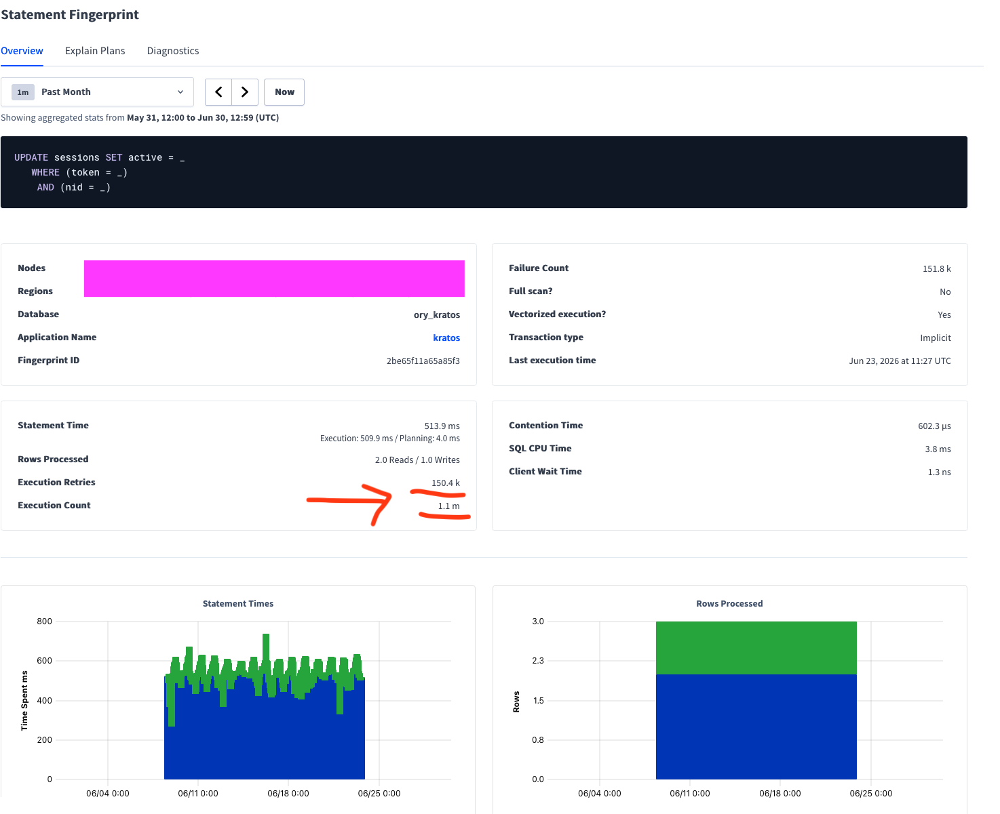
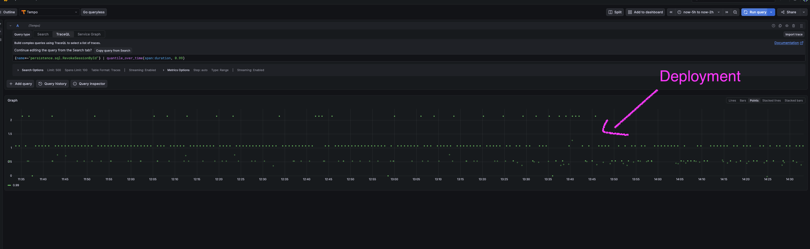
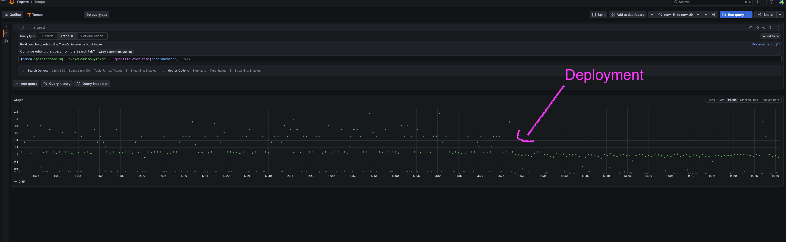
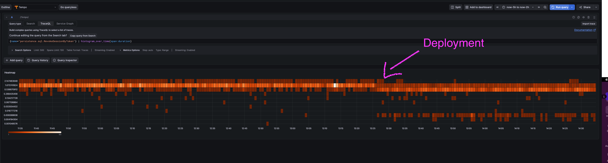

Title: Optimization tales with CockroachDB: the slow logout
Tags: SQL, Optimization, CockroachDB
---

Quick question: What do you do when there is downtime at work? Read the news, tidy your inbox... Hunt for slow SQL queries?

I'm in the last bucket. Emboldened by my recent success in speeding up the [password reset flow](/blog/optimization-tales-cockroachdb-part1.html), where too many rows were scanned, I stumbled upon a query that looked so simple, yet was very slow and did *thousands* of retries, for an endpoint that is very heavily used... This piqued my interest.

As always, the work is [open-source](https://github.com/ory/kratos/commit/277d7697125df31f6ea3dc4f773548218fdbfa79)!


*This is part 2 of my optimization adventures with CockroachDB. See [part 1](/blog/optimization-tales-cockroachdb-part1.html).*

## The context

150K retries, 500 ms statement time:




Contrary to part 1, this time, rows scanned and CPU time are completely fine. But there are way too many retries. 


This query (and many variations of it, all suffering from the same issue), are executed when logging out a user. A user is logged out by setting `active` to false on their session row in the `sessions` table:

```sql
UPDATE sessions SET active = false WHERE token = ?
```

This is such a simple query. It uses the right index. And yet it misbehaves. Time to investigate!


## Investigation


CockroachDB gives us a nice warning on the same page:

```plaintext
Error Code: 40001

Error Message: TransactionRetryWithProtoRefreshError: ReadWithinUncertaintyIntervalError: read at time 1781712863.936725360,0 encountered previous write with future timestamp 1781712863.957518522,0 within uncertainty interval 't<= (local=1781712864.036725360,0, global=1781712864.036725360,0)'; observed timestamps: [{25 1781712864.055700939,0} {62 1781712864.179153461,0} {63 1781712863.936725360,0}]: "sq| txn" meta={id=920488bd key=/Min iso=Serializable pri=0.00655660 epo=0 ts=1781712863.936725360,0 min=1781712863.936725360,0 seq=0} lock=false stat=PENDING
```

If it looks like gibberish to you... Know that it did to me initially. Let's unpack it slowly:

- `TransactionRetryWithProtoRefreshError`: the transaction was aborted by the server and the client was instructed to retry. We'll see why in a second. This is completely expected and normal behavior in CockroachDB in the default isolation level (Serializable).
- `ReadWithinUncertaintyIntervalError: read [...] encountered previous write`: We tried to read the row containing the session token, in order to write to it, but we encounter a value with a higher (meaning: more recent) timestamp. So we conservatively have to restart from the top: re-read the fresh row data.


## But why?


In a nutshell: we do an unconditional write to the row. It might not look like it because there is a `WHERE` clause. But this `WHERE` clause is actually only used to find the one row to update (using the session token). Once we have found the row, we write `active = false` to it *every time*. Even if `active` is already false! We do not check `active` at all. So two or more concurrent writes will all compete on the same row. 

Due to the implicit transaction wrapping our update, using the default isolation level `SERIALIZABLE` (the strictest), we fall victim to transaction contention.


Quoting the [docs](https://www.cockroachlabs.com/docs/v26.2/performance-best-practices-overview#transaction-contention):

> By default under SERIALIZABLE isolation, transactions that operate on the same index key values (specifically, that operate on the same column family for a given index key) are strictly serialized. To maintain this isolation, SERIALIZABLE transactions refresh their reads at commit time to verify that the values they read were not subsequently updated by other, concurrent transactions. If read refreshing is unsuccessful, then the transaction must be retried.

But this is wasted work, because the first write that succeeds is enough: once we have marked the row as `active = false`, no code ever toggles `active` back to `true`, this is a final state. So all subsequent writes to this row should be no-ops, instead of retrying a number of times, and finally succeeding, having achieved *nothing*!

> And then is heard no more: it is a tale told by an idiot, full of sound and fury, signifying nothing.
> 
> Macbeth, Act 5, Scene 5

## First optimization: conditional write

So, let's make the write conditional: we'll only write to the row if `active` is `true`:


```sql
UPDATE sessions SET active = false WHERE active = true AND token = ?
```


There is no semantic change, and yet, this means way fewer writes (up to 1, now) and fewer retries. Why? Because [transaction conflicts](https://www.cockroachlabs.com/docs/v26.2/architecture/transaction-layer#transaction-conflicts) in CockroachDB happen in two main cases, write-write and write-read:

> CockroachDB's transactions allow the following types of conflicts that involve running into a write intent:
>
> Write-write, where two transactions create write intents or acquire a lock on the same key.
>
> Write-read, when a read encounters an existing write intent with a timestamp less than its own. 

We now avoid the write-write scenario, yay! We still have the other case (write-read) that can happen: 

1. Transaction A starts
1. Transaction B starts
1. Transaction A writes to the row
1. Transaction A commits
1. Transaction B reads from the row => write-read conflict


Let's tackle that now.

## Second optimization: read committed

CockroachDB supports (only) two isolation levels: `SERIALIZABLE` (the default) and `READ COMMITTED`. The latter can unlock some performance (meaning: drastically reduce retries) at the cost of [concurrency anomalies](https://www.cockroachlabs.com/docs/v26.2/read-committed#concurrency-anomalies). If these anomalies are acceptable, then we could use that level. Per the [docs](https://www.cockroachlabs.com/docs/v26.2/read-committed):

> READ COMMITTED isolation is appropriate in the following scenarios:
>    Your application needs to maintain a high workload concurrency with minimal transaction retries, and it can tolerate potential concurrency anomalies. Predictable query performance at high concurrency is more valuable than guaranteed transaction serializability.

Let's see what these anomalies are:

- Non-repeatable reads: "Non-repeatable reads return different row values because a concurrent transaction updated the values in between reads". Since we do not do more than one read, we are not affected by that.
- Phantom reads: "Phantom reads return different rows because a concurrent transaction changed the set of rows that satisfy the row search": we do not write to any of the columns included in the `WHERE` criteria, these are constant (e.g. the session token). So we are not affected by that either.
- Lost update anomaly: "The READ COMMITTED conditions that permit non-repeatable reads and phantom reads also permit lost update anomalies, where an update from a transaction appears to be "lost" because it is overwritten by a concurrent transaction". We do not care about that because as long as one write `active = false` on the row succeeds, all subsequent writes are irrelevant. In fact, this is our goal: to avoid redundant updates.
- Write skew anomaly: "two concurrent transactions each read values that the other subsequently updates". We also are fine with that: in the worst case, our transaction will read `active` as `true` when another concurrent transaction has already set it to `false`, and our transaction will do one redundant write. Completely fine.

Ok, so let's do it:


```sql
BEGIN TRANSACTION ISOLATION LEVEL READ COMMITTED;

UPDATE sessions SET active = false WHERE active = true AND token = ?;

COMMIT;
```


## One last hurdle: does the row even exist?


Some variations of this query actually check if the `UPDATE` affected any rows. If it did not, it means the session token did not exist, and the endpoint returns an error. Which is a bit debatable to me because it breaks idempotency and I don't really see the point. But it was important to me to avoid any breaking changes.

And the problem is that by adding `WHERE active = true`, we broke it: we cannot distinguish anymore whether the row count is 0 because the row did not exist, or because it existed and was already marked as inactive.

So, with some SQL acrobatics, I came up with this query using two CTEs to keep the same API contract:

```sql
WITH found AS (
  SELECT id
  FROM sessions
    WHERE token = ?
),
upd AS (
  UPDATE sessions SET active = false
  FROM found
    WHERE sessions.id = found.id
    AND sessions.active = true RETURNING 1)
SELECT count(*)
FROM found
```

With the caveat that an `UPDATE` inside a CTE (and `RETURNING`) only works in CockroachDB and PostgreSQL.


Our optimizations still apply: we use `WHERE active = true` and wrap this ~monstrosity~ quirky query in a `READ COMMITTED` transaction. The API did not change, and we still improved performance.


There is one downside: there is a component that sometimes deletes rows in this table. This means that we still have contention (which existed before) with this component when finding out if the row exists. Which is why, I believe, now that these optimizations have been deployed, I still see some (less than before the optimizations) retries for that particular query. But unless we make a breaking change in the API, we cannot do much about it.

## Final results

p99 was halved (from ~2.2s to 1.1s) 


p95 went from ~1.6s to 1s:



Overall all latencies decreased and the extremes are less extreme (as expected):



There are two interesting things on this histogram:

- The upper bucket essentially disappeared. We can conjecture that these high latencies were due to retries, and that fits the decrease of p99 and p95
- A new bucket appeared for ultra-low latencies. So essentially all latencies moved down a bucket, which is great.

Also, contention and CPU time of the query (and all variations thereof) went to essentially 0 in the CockroachDB dashboard.


I am not yet satisfied with these absolute numbers, I believe there is still room for improvement, but I am still happy about the impact of this change.

## Conclusion

Having the highest isolation level by default is I think the right call from the CockroachDB developers. But it can create some performance hotspots.

As always: thoroughly read the docs of your database(s). Each one is its own thing. Do not assume that database A behaves like database B you know.

As with most optimizations, it's not about making the work faster, it's about avoiding unnecessary work.


Have a basic understanding of how long something should take: updating one column in one row should not take several seconds.


Follow up when the optimization has been applied: did it actually work? Can you observe it?


Know your data and access patterns: what fields are constants, which ones are only mutated in one direction (e.g. active: `true` -> `false`), etc. This knowledge unlocks many optimizations.


