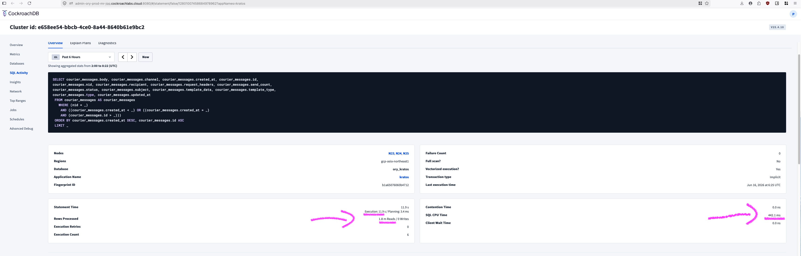
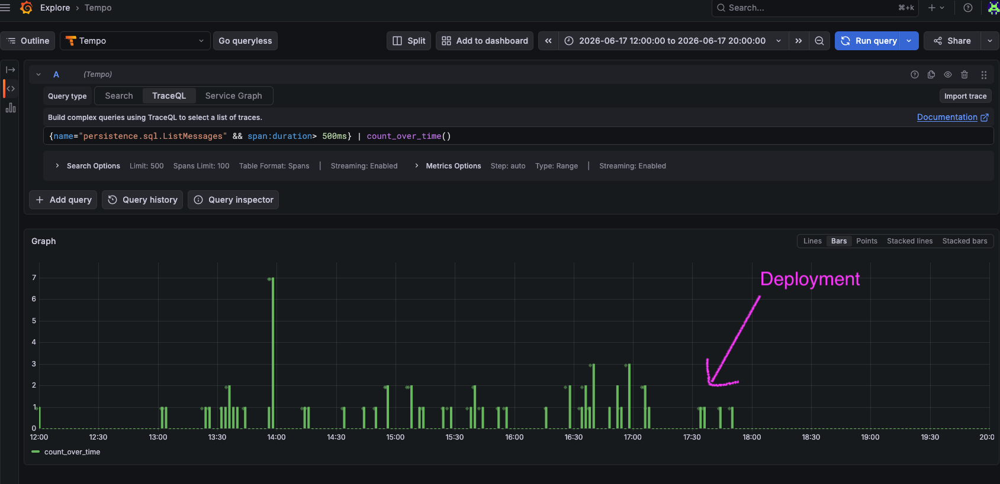

Title: Optimization tales with CockroachDB: the slow list of messages (part 3)
Tags: SQL, Optimization, CockroachDB
---

After fixing [too many rows scanned](/blog/optimization-tales-cockroachdb-part1.html) and [too many retries](/blog/optimization-tales-cockroachdb-part2-slow-logout.html), I came back to the list of slowest queries in the CockroachDB dashboard. 

This one piqued my curiosity: 12s runtime, 1.8 million rows read, SQL CPU time of 442 ms:



Which is weird given that there is a `LIMIT` there. I don't remember what the actual limit is in the code, I think it is `LIMIT 100`. In any case: we are reading millions of rows and throwing them nearly all away, in a very slow manner. 

The worst thing is: this query is doing pagination: reading one page of 100 entries in a table. It should take < 0.5s tops.

As always, the code is [open-source](https://github.com/ory/kratos/commit/6a4842144492f41a8598629f16e63a1617257cc0)!

## The investigation

The table (only showing the relevant fields) looks like this:


```sql
CREATE TABLE courier_messages (
  id UUID NOT NULL,
  created_at TIMESTAMP NOT NULL,
  nid UUID NULL,

  -- [...]

  INDEX courier_messages_nid_recipient_created_at_id_idx (nid ASC, recipient ASC, created_at DESC)
)
```

`nid` is the tenant id, because [Kratos](https://github.com/ory/kratos) in its enterprise edition supports multi-tenancy, and each row stores the tenant id. Since it is a constant here, we can ignore it.

And the query roughly does:

```sql
SELECT * 
FROM courier_messages
WHERE nid = ? 
    AND (created_at < ? OR created_at = ?)
    AND id > ?
ORDER BY created_at DESC, id ASC
LIMIT 100;
```

This is basic pagination by id. The query gets generated from a pagination library so it looks a bit funky and perhaps slightly suboptimal but it works correctly.

So why is it so goddamn slow?


I looked at the first step in the plan using `EXPLAIN ANALYZE` and I see we do use the index `courier_messages_nid_recipient_created_at_id_idx` (indeed, the statistics from CockroachDB mentioned `Full table scan: No`):

```plaintext
table: courier_messages@courier_messages_nid_recipient_created_at_id_idx
spans: [/'gcp-asia-northeast1'/'000e377a-062c-45b1-961c-1b28d682df6a' - /'gcp-asia-northeast1'/'000e377a-062c-45b1-961c-1b28d682df6a'] [/'gcp-europe-west3'/'000e377a-062c-45b1-961c-1b28d682df6a' - /'gcp-europe-west3'/'000e377a-062c-45b1-961c-1b28d682df6a'] [/'gcp-us-east4'/'000e377a-062c-45b1-961c-1b28d682df6a' - /'gcp-us-east4'/'000e377a-062c-45b1-961c-1b28d682df6a'] [/'gcp-us-west2'/'000e377a-062c-45b1-961c-1b28d682df6a' - /'gcp-us-west2'/'000e377a-062c-45b1-961c-1b28d682df6a']
```

Let's unpack it, the index in use is `nid ASC, recipient ASC, created_at DESC)`, and a span is `/'gcp-asia-northeast1'/'000e377a-062c-45b1-961c-1b28d682df6a' - /'gcp-asia-northeast1'/'000e377a-062c-45b1-961c-1b28d682df6a'`, which means:

1. We use CockroachDB in a multi-region setup. The query is fanned-out to all regions in parallel. So far so good.
1. The `nid` (i.e. tenant id) is then used in the index, so that only rows for the current tenant are scanned. That's great.
1. That's it.


Wait wait wait. That means we are reading all the rows of the tenant in memory, and then doing some post-processing to apply the remaining filters? But that makes no sense, because the query provides `created_at`, but this field is not used at all in the index!


Aaaah, I understand now: that is the same issue as in [part 1](/blog/optimization-tales-cockroachdb-part1.html). We use a multi-column index `(A, B, C)` and provide only `A` and `C`, which means the database can only really use `A` (i.e.: `nid`, the tenant id) in the index, and scans all of the remaining rows into memory. That explains why we read millions of rows.


I'll re-use the diagrams from [part 1](/blog/optimization-tales-cockroachdb-part1.html) to explain how the index looks like from the database perspective:


The optimal use is a point lookup, where all fields of the index are provided by the query:


But what we are doing is only providing the first one, effectively:


Which is very inefficient.


Even worse: due to the `ORDER BY` clause, we load these millions of rows into memory, then we sort them, then we filter them, and finally we apply the `LIMIT`. That explains the high SQL CPU time of 442 ms.

These steps are visible in the plan:


```plaintext
  └── • limit
      │ count: 100
      │
      └── • filter
          │ [...]
          │ filter: (created_at < '2026-06-16 09:02:42.094011') OR ((created_at = '2026-06-16 09:02:42.094011') AND (id > '5956b380-9f51-4882-be87-277e05b60d23'))
          │
          └── • sort
              │ [...]
              │ order: -created_at,+id
              │
              └── • scan
                    [...]
                    table: courier_messages@courier_messages_nid_recipient_created_at_id_idx
                    spans: [/'gcp-asia-northeast1'/'000e377a-062c-45b1-961c-1b28d682df6a' - /'gcp-asia-northeast1'/'000e377a-062c-45b1-961c-1b28d682df6a'] [/'gcp-europe-west3'/'000e377a-062c-45b1-961c-1b28d682df6a' - /'gcp-europe-west3'/'000e377a-062c-45b1-961c-1b28d682df6a'] [/'gcp-us-east4'/'000e377a-062c-45b1-961c-1b28d682df6a' - /'gcp-us-east4'/'000e377a-062c-45b1-961c-1b28d682df6a'] [/'gcp-us-west2'/'000e377a-062c-45b1-961c-1b28d682df6a' - /'gcp-us-west2'/'000e377a-062c-45b1-961c-1b28d682df6a']
```

So, completely suboptimal.


## The right fix


What we want is this index: `(nid, created_at, id)` so that the 3 provided fields in the query are used in the index.

It turns out that this index used to exist! And then at some point it was removed. Either the person thought this index is unused, or that another index is better in this case. But that was the wrong move. 

Ok, so we just have to re-add it I guess:

```sql
CREATE INDEX courier_messages_nid_created_at_id_idx
  ON courier_messages (nid ASC, created_at DESC, id ASC);
```

CockroachDB has a cool feature where you can add an index in production as `NOT VISIBLE`, which means no queries use it, and then when testing, you can force your query to see the index and use it. I did that, and I confirmed the same query used the new index. Since indexes are added in a background job (and we can even lower the load with `LOW PRIORITY`), we have the luxury to experiment in production safely.


Since `Kratos` supports 4 databases (SQLite, PostgreSQL, MySQL, CockroachDB), and this fix works on all databases, every single user benefits from it!


## The wrong fix

Since the query provides `nid`, `id`, and `created_at`, would the index `(nid, id, created_at)` also work?

Counter-intuitively: no! 

Why is that?

The query does: `ORDER BY created_at DESC, id ASC`. The order matters: first we sort by `created_at`, and then by `id`.  With the index `(nid, id, created_at)`, `created_at` is not the left-leading column after `nid` so the `ORDER BY` no longer matches the order of the index fields. That would force the planner to load all of the rows into memory and sort them there!

Order matters. 


We alternatively could drop `id` from the `ORDER BY` clause since it is actually not required in this particular case, but I decided not to, because that would require modifying the pagination library that generates this query. This pagination library is used throughout the codebase so that would be a big risky change.


## Results

Comparing the statistics in the CockroachDB dashboard before/after, that's what we see:

|Metric        |  Before (2026-06-16)   | After (2026-06-18)|
|  ---------------| -------------------- |  ------------------|
|  Statement time |   11.9 s |                740 ms |
|  Rows read |        1.8 M / exec |          10.3 / exec |
|  SQL CPU          | 442 ms                | 235 µs |


Great success.

We can also see that the degenerate cases (tenants with lots of rows which results in many seconds of latency - here filtering for `> 500 ms`) are all gone:



## Conclusion

This issue was quite similar to part 1, with a similar number of rows scanned in the millions. This one resulted in an even worse CPU usage due to the sorting done in the query (`ORDER BY`), and while in part 1, the fix was to specify more fields in the query to better use the existing index, here we instead chose to add a previously (and erroneously) removed index.
