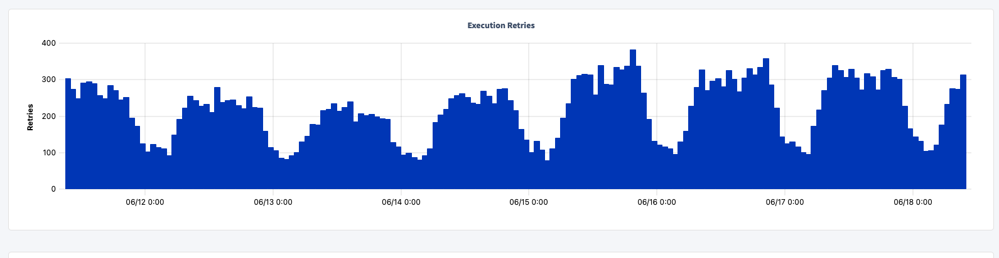
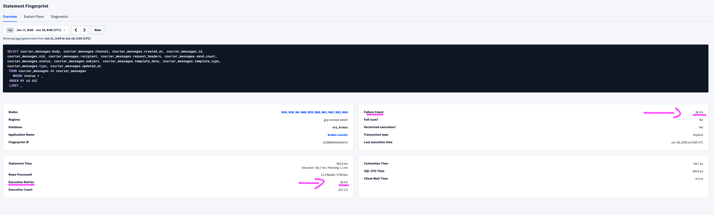
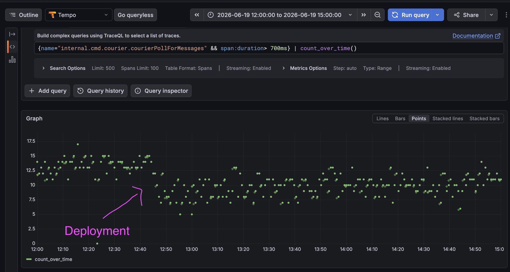
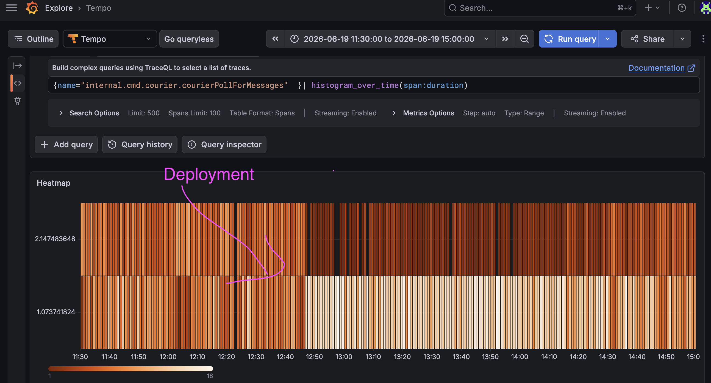

Title: Optimization tales with CockroachDB: the slow dequeue of messages (part 4)
Tags: SQL, Optimization, CockroachDB
---

Today, this is the story of a failed optimization. Or rather, an optimization that did not have as big an impact as expected. I think it's important to also tell these tales and not present an unrealistic, rosy view of optimization adventures. Sometimes, they don't quite work as you hoped.


In the [last part](/blog/optimization-tales-cockroachdb-part3-slow-list-messages.html), we optimized listing all messages in the table of messages `courier_messages`. This is a big table with millions of rows and a lot of churn: this is where all SMS or email notifications are stored before being sent. It is essentially a work queue. And there is one problem: way too many retries to get the next messages to work on:



Worse: the failure count is identical to the number of retries:




Retrying so many times means that the tail latencies (p95, p99) are really inflated.


All other metrics look fine. Weird. Time to investigate.

As always, the code is [open-source](https://github.com/ory/kratos/blob/master/persistence/sql/persister_courier.go#L71).

## Context

As mentioned, this table acts as a work queue. The simplified schema is:

```sql
CREATE TABLE public.courier_messages (
  id UUID NOT NULL,
  status INT8 NOT NULL
  
  -- [...] 
);
```

And new messages are added with the status `queued`.

So to get the next batch of messages to deliver, the query does:

```sql
SELECT *
FROM courier_messages
WHERE status = 'queued'
ORDER BY id ASC
LIMIT 500
```

I do not remember what the exact limit is, but it's something like that. And then when messages are delivered, their status is set to `sent` (on success), `abandoned` (after too many retries), etc.


It's pretty simple, and from the plan and metrics, we notice that the correct index is used. 

So why so many retries?


## Investigation


The [code](https://github.com/ory/kratos/blob/master/persistence/sql/persister_courier.go#L71) is very short and simply runs this query in a loop (and then handles the messages). 

Two important points for CockroachDB:

- The default isolation level is `SERIALIZABLE`, the strictest
- For a number of reasons, concurrent access of the same rows may make the database force the client (our application) to retry


The error from the retries is:

```plaintext
Error Code: 40001
Error Message: TransactionRetryWithProtoRefreshError: ReadWithinUncertaintyIntervalError: read at time 1781712863.936725360,0 encountered previous write with future timestamp 1781712863.957518522,0 within uncertainty interval t <= (local=1781712864.036725360,0, global=1781712864.036725360,0); observed timestamps: [{25 1781712864.055700939,0} {62 1781712864.179153461,0} {63 1781712863.936725360,0}]: "sql txn" meta={id=920488bd key=/Min iso=Serializable pri=0.00655660 epo=0 ts=1781712863.936725360,0 min=1781712863.936725360,0 seq=0} lock=false stat=PENDING rts=1781712863.936725360,0 gul=1781712864.036725360,0 obs={n25@1781712864.055700939,0 n62@1781712864.179153461,0 n63@1781712863.936725360,0}
```

Let's unpack it:

- `TransactionRetryWithProtoRefreshError`: The database instructed us to retry
- `ReadWithinUncertaintyIntervalError: read [...] encountered previous write`: This means that we have a read-write contention scenario, where our query tries to read the messages, but another part of the code wrote to these ~rows~ the scanned range, so in order to 'read your writes', we have to start from the top and retry.

What is the difference between 'wrote to these rows' and 'wrote to this scanned range'? Well, let's put ourselves in the database shoes. There is this big table, and we want to read rows from it with only one criteria: `status = 'queued'`. Yes, the query has a `LIMIT 500`, but since a healthy queue is normally drained, the scan reads to the end of the span range, which means that the new `INSERT`s land within the scan range.

Our query uses the index `(status ASC, id ASC)`. So the 'scan range' is: all messages in the 'queued' status. 

And you know what counts as a write in this table *and* is part of this scan range? An `INSERT`! Yes that's right: new messages are enqueued all the time, concurrently, using `INSERT`, and with the status 'queued'. These count as a write, and they contend with our query, because technically, the current list of queued messages is constantly changing, so we need to constantly retry! That's also completely unneeded: we do not need the exact, most recent list of queued messages, we only need 500 arbitrary 'queued' messages.


As an aside: there are other components that read these rows, e.g. the search API, but read-read contention is not a thing: concurrent reads are fine and do not cause retries.


Importantly: there is only one worker instance, globally. So we do not have any concurrent writes[^1] (write-write scenario), only read-writes. But that's frustrating: we want to be able to process as many messages as possible, and we are constantly retrying for no good reason.

[^1]: Almost. We have two sources of concurrent writes: A) Once the worker is finished with handling a batch, it updates the status of each message accordingly, e.g. `status = 'sent'`. These writes could overlap with the read of the next batch due to clock skew, and because we do not wait (i.e. sleep) between batches. So from the database perspective, the last write and the new read would overlap and create a write-read contention. B) Rows in this table have a TTL of 30 days, so they get removed automatically by the database in the background. But it's rare that messages still in the `queued` state would reach this TTL.


## The fix

We remember a crucial quote from the [docs](https://www.cockroachlabs.com/docs/v26.2/read-committed):


> Whereas SERIALIZABLE isolation guarantees data correctness by placing transactions into a serializable ordering, READ COMMITTED isolation permits some concurrency anomalies in exchange for minimizing transaction aborts, retries, and blocking.


So, can we live with these [concurrency anomalies](https://www.cockroachlabs.com/docs/v26.2/read-committed#concurrency-anomalies)? Let's see:


- Non-repeatable reads: "Non-repeatable reads return different row values because a concurrent transaction updated the values in between reads". Since we do not do more than one read, we are not affected by that.
- Phantom reads: "Phantom reads return different rows because a concurrent transaction changed the set of rows that satisfy the row search": Since we do not do more than one read, we are not affected by that.
- Lost update anomaly: "The READ COMMITTED conditions that permit non-repeatable reads and phantom reads also permit lost update anomalies, where an update from a transaction appears to be "lost" because it is overwritten by a concurrent transaction". We do not write in this transaction so we are good.
- Write skew anomaly: "two concurrent transactions each read values that the other subsequently updates". No concurrent transaction is writing to the same rows so we are also fine there.


Ok, so let's do it:


```sql
BEGIN TRANSACTION ISOLATION LEVEL READ COMMITTED;

SELECT *
FROM courier_messages
WHERE status = 'queued'
ORDER BY id ASC
LIMIT 500

COMMIT;
```

Other databases do not need a change, only CockroachDB uses `SERIALIZABLE` as the default isolation level.


Simple fix. Before, an implicit transaction was used (with the default isolation level `SERIALIZABLE`), now we use an explicit `READ COMMITTED` transaction.

## The results


Slow values (> 700 ms query latency) have become somewhat rarer (~15/s to ~10/s):




Slow (> 1s) latencies have become visibly rarer, and less slow (< 1s) latencies have become more frequent (unfortunately these buckets are very coarse): 




It's not the optimization of the century, but it's a bit better.


However, we still have a lot of retries for this query. 

The official [docs](https://www.cockroachlabs.com/docs/stable/read-committed) offer an explanation:


> In rare cases under READ COMMITTED isolation, a RETRY_WRITE_TOO_OLD or ReadWithinUncertaintyIntervalError error can be returned to the client if a statement has already begun streaming a partial result set back to the client and cannot retry transparently.

Coupled with:

> Increase the chance that CockroachDB can automatically retry a failed transaction:
> > Limit the size of the result sets of your transactions to less than the value of the sql.defaults.results_buffer.size cluster setting, so that CockroachDB is more likely to automatically retry when previous reads are invalidated at a pushed timestamp. When a transaction returns a result set larger than the configured buffer size, even if that transaction has been sent as a single batch, CockroachDB cannot automatically retry the transaction.

And it turns out that the result set usually exceeds this buffer size (16 KiB by default) and thus the server cannot transparently retry.


## Future optimizations


The big issue that creates contention and retries is the scan range: it is huge, due to the big table and the search criteria `WHERE status = 'queued'` that accidentally encompasses newly inserted rows.


The better fix is to reduce the scan range: I believe that adding to the `WHERE` clause more precise criteria to exclude these new rows would go a long way, for example: `WHERE status = 'queued' AND created_at < now() - 1 second`.

But this would not help if we keep the existing index of `(status, id)`: we would have the exact same scan range as before, and the `created_at` filter would only be applied too late.


We would need to create the index `(status, created_at, id)` to effectively reduce the scan range. And also adapt the `ORDER BY` to be: `ORDER BY created_at` so that it uses the index fields.


## Wrong optimizations

CockroachDB allows a query to see a past version of the data with `SELECT ... AS OF SYSTEM TIME '-1s'` or `AS OF SYSTEM TIME follower_read_timestamp()`. However, that means that we would also see messages that just got delivered successfully and were just marked as 'sent', e.g. from the previous batch. This would lead to duplicate deliveries for this window of time.

`SELECT ... FOR UPDATE` seems like a natural thing to do in these 'work queue' systems implemented with an SQL database. In fact I used that myself in the past. However this is completely orthogonal: `FOR UPDATE` is used to lock the rows that one worker is working on, to avoid other workers also working on these rows. This is to avoid duplication of work, not to reduce read-write contention. Since we have only one worker here, this is unnecessary and would not help performance. In fact it would worsen performance: `FOR UPDATE` acquires locks, which in CockroachDB are replicated, so our read now becomes a write! And it's a lock that only our single worker is using, so that's completely unnecessary in the current architecture.


## Conclusion


Reflecting on this investigation and somewhat failed optimization, I think where I failed is: I did not fully understand where the concurrent writes came from (i.e.: `INSERT`), and that the scan range is what matters for contention, not the returned rows. Well, I'll try to deploy this `WHERE created_at < now() - 1 second` additional optimization and follow up with another post.
