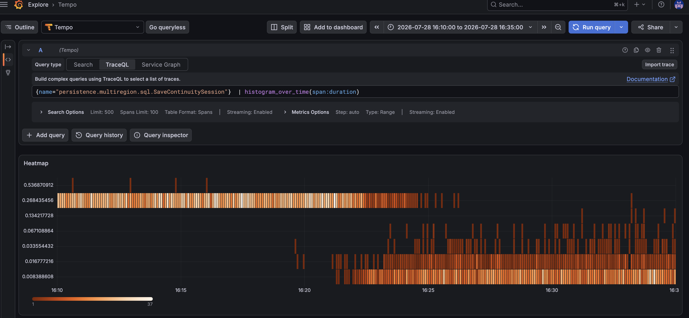
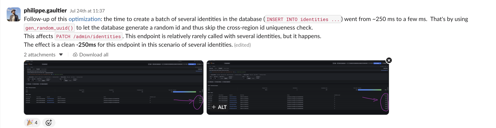

Title: Optimization tales in production with CockroachDB: UUID generation (part 5)
Tags: SQL, Optimization, CockroachDB
---

*This is part 5 of a series of optimization tales using CockroachDB. See [part 1](/blog/optimization-tales-cockroachdb-part1.html), [part2](/blog/optimization-tales-cockroachdb-part2-slow-logout.html), [part 3](/blog/optimization-tales-cockroachdb-part3-slow-list-messages.html), [part 4](/blog/optimization-tales-cockroachdb-part4-slow-list-users.html).*

I am ashamed to say that I discovered this trick very recently. It's so simple and yet powerful, and it's the building block for more optimizations I did later. 


So here it is: in [Kratos](https://github.com/ory/kratos), all database ids are UUIDs v4, meaning: 122 random bits[^1]. And most of our tables are `REGIONAL BY ROW`, meaning: the data is sharded by region, and we can ensure at the database level that data for an entity (including all of its related data in JOIN tables) is located in one region. Which is fantastic for compliance and regulatory reasons!

Since an id has to be unique (this is the primary key in the table), the naive way to check unicity in a multi-region setup, when `INSERT`-ing a new entry:

```sql 
INSERT INTO my_table (id, some_column, crdb_region) VALUES ('d32223a5-34fd-468a-ab43-aef455d16e0c', 'foo', 'eu-west3');
```

is to ask each region (in parallel): do you know this (uu)id already? If all of them reply with 'no', then we are good and we can use it for a new entry.

You might be wondering: isn't there a TOCTOU window here? Could a remote region use this ID for an `INSERT` right after telling us it is not yet used, thus racing with our own `INSERT`? Well, thankfully no: a write in SQL (`INSERT`, `UPDATE`, `DELETE`, etc) first sends a write intent to other regions (when there is a unique constraint on a field in the record), saying "I would like to do this write, is that ok?", and only then it tries to write the record, and the write is committed only when all regions have confirmed there is no constraint violation.

All of this yields: when we do an `INSERT` on a `REGIONAL BY ROW` table, even if it's just randomly generated values that have no chance of already existing, we wait for all regions to answer, and that takes in our setup around 250ms. Each time. That sucks.

An astute reader may now be asking: well, if this value is 122 random bits[^1], there is essentially no chance of collision, it is unique by construction given a good enough random number generator, so why both asking the other regions, when the answer will be in 99.9999999[...]9999% of the cases: 'this id is unknown to me'?

Indeed, and that's why we use UUIDs (v4) in the first place, for unicity by construction. 

The good news is, CRDB developers know that and for this reason, they provide the built-in function `gen_random_uuid()` which, as you might expect, generates a UUID v4, but more importantly, *skips* the unique check for this field. That's huge: it means that if there are no other unique constraints on the table, we now can do an `INSERT` in multi-region mode *instantly*, without contacting the remote regions at all! 

Note that we are taking a (minuscule) risk: if there is indeed, by some massive cosmic bad luck, truly a collision between UUIDs, and the same UUID already exist in another region, we would not notice it. But that chance is so mathematically unprobable, that this is a tradeoff we are willing to do. And there is some solace: if the UUID does exist in our local region, we *would* notice, because the unique check is still performed there (and it's quite cheap).

Our `INSERT` now becomes: `

```sql 
INSERT INTO my_table (id, some_column, crdb_region) VALUES (gen_random_uuid(), 'foo', 'eu-west3') RETURNING id;
```

So, the best example of this optimization taking place is this change, where a very frequent `INSERT` went from ~250 ms (typical latency between regions) to ~5ms, simply by moving the UUID generation from the application to the database:



And then I started using it everywhere, and every time, the `INSERT` went from a stable ~250ms to ~5ms, even when we insert several values at once:




Pretty cool given that it's a trivial, and more importantly, trivially correct, change. 


There's one big caveat though: if any other column in the `INSERT` has a unique constraint, the cross-region check must happen, and this trick buys us nothing.


And finally, if for some reason the application logic and queries cannot be easily modified, CockroachDB offers a setting to turn off unique checks, to achieve the same. But I would not recommend doing that.

## Conclusion

Given that I work on a complex, 10 years old production system where no downtime is allowed and tons of customers, the only optimizations that are acceptable are the ones that:

- **demonstrably** improve the performance without having to deploy it for real: For that I typically use query plans, documentation, benchmarks, prior similar optimizations, etc 
- are **verifiably correct**: Here I use tests ideally with 100% coverage, capturing what SQL queries are generated by the new code, snapshotting API responses before/after to verify that are no observable differences, etc 
- are observable by the customer (in some cases, we are the customer, e.g. for internal services): if it does not benefit anyone, if no one can see or measure the before/after effect, why even do it? Typically I use production traces for that, which show what endpoint and operation it would benefit, and the current latency. Sometimes I inspect the latency of SQL queries in production as well, but traces already include that, and more, so in my view traces are superior.

Otherwise they stay on the cutting floor. To date I have deployed 40+ optimizations to the production system and all of them had a visible impact, and none of them had to be rolled back.


[^1]: From Wikipedia: "a random version-4 UUID will have six predetermined variant and version bits, leaving 122 bits for the randomly generated part, for a total of 2^122, or 5.3×10^36 (5.3 undecillion) possible version-4, variant-1 UUID".
