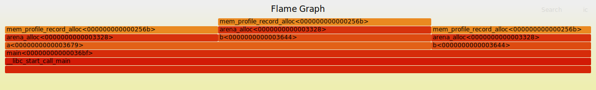

<link rel="stylesheet" type="text/css" href="main.css">
<link rel="stylesheet" href="https://unpkg.com/@highlightjs/cdn-assets@11.8.0/styles/default.min.css">
<script src="https://unpkg.com/@highlightjs/cdn-assets@11.8.0/highlight.min.js"></script>
<script src="https://unpkg.com/@highlightjs/cdn-assets@11.8.0/languages/x86asm.min.js"></script>
<script>
window.addEventListener("load", (event) => {
  hljs.highlightAll();
});
</script>

<a href="/blog">All articles</a>

# Roll your own memory profiling: it's actually not hard

*Or: An exploration of the [pprof](https://github.com/gperftools/gperftools) memory profiler and its textual format for fun an profit.*

Say that you are using a programming language where memory is manually managed, and you have decided to use a custom allocator for one reason or another, for example an arena allocator, and are wondering:

- How do I track every allocation, recording how many bytes were allocated and what was the call stack at that time?
- How much memory is my program using, and what is the peak use?
- How much memory does my program free? Is it all of it (are there leaks)?
- Which line of code in my function is allocating, and how much?
- I want a flamegraph showing allocations by function

What to do?

Well, it turns out that this can all be achieved very simply without adding dependencies to your application, in ~100 lines of code (including lots of comments). I'll show one way and then explore other possibilities. And here are the results we are working towards:


The only requirement to make it all work is to be able to run a bit of code on each allocation.

Another good reason to do this, is when the system's `malloc` comes with some form of memory profiling which is not suitable for your needs and you want something different/better/the same on every platform.

>  If you spot an error, please open a [Github issue](https://github.com/gaultier/blog)!

**Table of Contents**
-   [Roll your own memory profiling: it's actually not
    hard](#roll-your-own-memory-profiling-its-actually-not-hard)
    -   [Pprof](#pprof)
    -   [The text format](#the-text-format)
    -   [Generating a `pprof` profile](#generating-a-pprof-profile)
    -   [Variations and limitations](#variations-and-limitations)
    -   [Alternatives](#alternatives)
    -   [Conclusion](#conclusion)

## Pprof

Here is the plan: 

1. Each time there is an allocation in our program, we record information about it in an array.
2. At the end of the program (or upon receiving a signal, a special TCP packet, whatever), we dump the information in the (original) [pprof](https://github.com/gperftools/gperftools) format, which is basically just a text file with one line per allocation (more details on that in a bit).
3. We can then use the (original) `pprof` which is just a [giant Perl script](https://github.com/gperftools/gperftools/blob/master/src/pprof) which will extract interesting information and most importantly symbolize (meaning: transform memory addresses into line/column/function/file information).

I will showcase this approach with C code using an arena allocator. The full code can be found in my project [micro-kotlin](https://github.com/gaultier/micro-kotlin/blob/pprof-original/str.h#L320). But this can be done in any language since the `pprof` text format is so simple! Also, using arenas, we do not bother to free anything so the memory profiling part is even simpler.

> The original `pprof` written in Perl is not to be confused with the rewritten [pprof](https://github.com/google/pprof) in Go which offers a superset of the features of the original but based on a completely different and incompatible file format (protobuf)!

## The text format

Here is the text format we want to generate:

```
heap profile:    <in use objects sum>:  <in use bytes sum> [   <space objects sum>:  <space bytes sum>] @ heapprofile
<in use objects>: <in use bytes> [<space objects>: <space bytes>] @ <rip1> <rip2> <rip3> [...]
<in use objects>: <in use bytes> [<space objects>: <space bytes>] @ <rip1> <rip2> <rip3> [...]
<in use objects>: <in use bytes> [<space objects>: <space bytes>] @ <rip1> <rip2> <rip3> [...]
                                                                             
MAPPED_LIBRARIES:
[...]

```

The first line is a header identifying that this is a heap profile (contrary to a CPU profile which `pprof` can also analyze, which uses a different, binary, format) and gives for each of the four fields we will record, their sum. 

Then comes one line per entry. Each entry has these four fields that the header just gave us a sum of:
- `in use objects`: How many objects are 'live' i.e. in use on the heap at the time of the allocation. Allocating increases its value, freeing decreases it.
- `in use bytes`: How many bytes are 'live' i.e. in use on the heap at the time of the allocation. Allocating increases its value, freeing decreases it.
- `space objects`: How many objects have been allocated since the start of the program. It is not affected by freeing memory, it only increases.
- `space bytes`: How many bytes have been allocated since the start of the program. It is not affected by freeing memory, it only increases.

So when we allocate an object e.g. `new(Foo)` in C++:
- `in use objects` and `space objects` increment by 1 
- `in use bytes` and `space bytes` increment by `sizeof(Foo)`

When we allocate an array of N elements of type `Foo`:
- `in use objects` and `space objects` increment by N
- `in use bytes` and `space bytes` increment by `N * sizeof(Foo)`

When we free an object:
- `in use objects` decrements by 1 
- `in use bytes` decrements by `sizeof(Foo)`

When we free an array of N elements of type `Foo`:
- `in use objects` decrements by N 
- `in use bytes` decrements by `N * sizeof(Foo)`

These 4 dimensions are really useful to spot memory leaks (`in use objects` and `in use bytes` increase over time), peak memory usage (`space bytes`), whether we are doing many small allocations versus a few big allocations, etc.
`pprof` also supports sampling and we could supply a sampling rate here optionally but we want to track each and every allocation so we do not bother with that.

Each entry (i.e. line) ends with the call stack which is a space-separated list of addresses. We'll see that it is easy to get that information without resorting to external libraries such as `libunwind` by simply walking the stack, a topic I touched on in a previous [article](/blog/x11_x64.html#a-stack-primer).

Very importantly, multiple allocation records with the same stack must be merged together into one, summing their values. In that sense, each line conceptually an entry in a hashmap where the key is the call stack (the part of the right of the `@` character) and the value is a 4-tuple: `(u64, u64, u64, u64)` (the part on the left of the `@` character).

The text file ends with a trailer which is crucial for symbolication (to transform memory addresses into source code locations), which on Linux is trivial to get: This is just a copy of the file `/proc/self/maps`. It lists of the loaded libraries and at which address they are.

I have not implemented it myself but a quick internet search shows that the other major operating systems have a similar capability, named differently:
- Windows: `VirtualQuery`
- macOS: `mach_vm_region_info`
- FreeBSD: `procstat_getvmmap` 


Here is a small example:

```c
#include <stdlib.h>

void b(int n) { malloc(n); }

void a(int n) {
  malloc(n);
  b(n);
}

int main() {
  for (int i = 0; i < 2; i++)
    a(2);

  b(3);
}
```

Leveraging `tcmalloc`, this program will generate a heap profile:

```sh
$ cc /tmp/test_alloc.c -ltcmalloc  -g3
$ HEAPPROFILE=/tmp/heapprof ./a.out
Starting tracking the heap
Dumping heap profile to /tmp/heapprof.0001.heap (Exiting, 11 bytes in use)
```

*This is just an example to showcase the format, we will from this point on use our own code to generate this text format.*

```
heap profile:      5:       11 [     5:       11] @ heapprofile
     2:        4 [     2:        4] @ 0x558e804cc165 0x558e804cc18e 0x558e804cc1b0 0x7f452a4daa90 0x7f452a4dab49 0x558e804cc085
     2:        4 [     2:        4] @ 0x558e804cc184 0x558e804cc1b0 0x7f452a4daa90 0x7f452a4dab49 0x558e804cc085
     1:        3 [     1:        3] @ 0x558e804cc165 0x558e804cc1c4 0x7f452a4daa90 0x7f452a4dab49 0x558e804cc085

MAPPED_LIBRARIES:
558e804cb000-558e804cc000 r--p 00000000 00:00 183128      /tmp/a.out
558e804cc000-558e804cd000 r-xp 00001000 00:00 183128      /tmp/a.out
558e804cd000-558e804ce000 r--p 00002000 00:00 183128      /tmp/a.out
558e804ce000-558e804cf000 r--p 00002000 00:00 183128      /tmp/a.out
558e804cf000-558e804d0000 rw-p 00003000 00:00 183128      /tmp/a.out
558e814b7000-558e81db8000 rw-p 00000000 00:00 0           [heap]
7f4529e7e000-7f452a112000 rw-p 00000000 00:00 0           
7f452a112000-7f452a115000 r--p 00000000 00:00 678524      /usr/lib/x86_64-linux-gnu/liblzma.so.5.4.1
7f452a115000-7f452a136000 r-xp 00003000 00:00 678524      /usr/lib/x86_64-linux-gnu/liblzma.so.5.4.1
7f452a136000-7f452a142000 r--p 00024000 00:00 678524      /usr/lib/x86_64-linux-gnu/liblzma.so.5.4.1
7f452a142000-7f452a143000 r--p 00030000 00:00 678524      /usr/lib/x86_64-linux-gnu/liblzma.so.5.4.1
7f452a143000-7f452a144000 rw-p 00031000 00:00 678524      /usr/lib/x86_64-linux-gnu/liblzma.so.5.4.1
7f452a144000-7f452a152000 r--p 00000000 00:00 668348      /usr/lib/x86_64-linux-gnu/libm.so.6
7f452a152000-7f452a1d0000 r-xp 0000e000 00:00 668348      /usr/lib/x86_64-linux-gnu/libm.so.6
7f452a1d0000-7f452a22b000 r--p 0008c000 00:00 668348      /usr/lib/x86_64-linux-gnu/libm.so.6
7f452a22b000-7f452a22c000 r--p 000e6000 00:00 668348      /usr/lib/x86_64-linux-gnu/libm.so.6
7f452a22c000-7f452a22d000 rw-p 000e7000 00:00 668348      /usr/lib/x86_64-linux-gnu/libm.so.6
7f452a22d000-7f452a22f000 rw-p 00000000 00:00 0           
7f452a22f000-7f452a2cb000 r--p 00000000 00:00 678806      /usr/lib/x86_64-linux-gnu/libstdc++.so.6.0.32
7f452a2cb000-7f452a3fc000 r-xp 0009c000 00:00 678806      /usr/lib/x86_64-linux-gnu/libstdc++.so.6.0.32
7f452a3fc000-7f452a489000 r--p 001cd000 00:00 678806      /usr/lib/x86_64-linux-gnu/libstdc++.so.6.0.32
7f452a489000-7f452a494000 r--p 0025a000 00:00 678806      /usr/lib/x86_64-linux-gnu/libstdc++.so.6.0.32
7f452a494000-7f452a497000 rw-p 00265000 00:00 678806      /usr/lib/x86_64-linux-gnu/libstdc++.so.6.0.32
7f452a497000-7f452a49b000 rw-p 00000000 00:00 0           
7f452a49b000-7f452a49e000 r--p 00000000 00:00 702044      /usr/lib/x86_64-linux-gnu/libunwind.so.8.0.1
7f452a49e000-7f452a4a8000 r-xp 00003000 00:00 702044      /usr/lib/x86_64-linux-gnu/libunwind.so.8.0.1
7f452a4a8000-7f452a4ab000 r--p 0000d000 00:00 702044      /usr/lib/x86_64-linux-gnu/libunwind.so.8.0.1
7f452a4ab000-7f452a4ac000 r--p 0000f000 00:00 702044      /usr/lib/x86_64-linux-gnu/libunwind.so.8.0.1
7f452a4ac000-7f452a4ad000 rw-p 00010000 00:00 702044      /usr/lib/x86_64-linux-gnu/libunwind.so.8.0.1
7f452a4ad000-7f452a4b7000 rw-p 00000000 00:00 0           
7f452a4b7000-7f452a4d9000 r--p 00000000 00:00 668342      /usr/lib/x86_64-linux-gnu/libc.so.6
7f452a4d9000-7f452a651000 r-xp 00022000 00:00 668342      /usr/lib/x86_64-linux-gnu/libc.so.6
7f452a651000-7f452a6a9000 r--p 0019a000 00:00 668342      /usr/lib/x86_64-linux-gnu/libc.so.6
7f452a6a9000-7f452a6ad000 r--p 001f1000 00:00 668342      /usr/lib/x86_64-linux-gnu/libc.so.6
7f452a6ad000-7f452a6af000 rw-p 001f5000 00:00 668342      /usr/lib/x86_64-linux-gnu/libc.so.6
7f452a6af000-7f452a6bc000 rw-p 00000000 00:00 0           
7f452a6bc000-7f452a6bf000 r--p 00000000 00:00 677590      /usr/lib/x86_64-linux-gnu/libgcc_s.so.1
7f452a6bf000-7f452a6da000 r-xp 00003000 00:00 677590      /usr/lib/x86_64-linux-gnu/libgcc_s.so.1
7f452a6da000-7f452a6de000 r--p 0001e000 00:00 677590      /usr/lib/x86_64-linux-gnu/libgcc_s.so.1
7f452a6de000-7f452a6df000 r--p 00021000 00:00 677590      /usr/lib/x86_64-linux-gnu/libgcc_s.so.1
7f452a6df000-7f452a6e0000 rw-p 00022000 00:00 677590      /usr/lib/x86_64-linux-gnu/libgcc_s.so.1
7f452a6e0000-7f452a6f3000 r--p 00000000 00:00 182678      /usr/lib/x86_64-linux-gnu/libtcmalloc.so.4.5.9
7f452a6f3000-7f452a719000 r-xp 00013000 00:00 182678      /usr/lib/x86_64-linux-gnu/libtcmalloc.so.4.5.9
7f452a719000-7f452a729000 r--p 00039000 00:00 182678      /usr/lib/x86_64-linux-gnu/libtcmalloc.so.4.5.9
7f452a729000-7f452a72a000 r--p 00048000 00:00 182678      /usr/lib/x86_64-linux-gnu/libtcmalloc.so.4.5.9
7f452a72a000-7f452a72b000 rw-p 00049000 00:00 182678      /usr/lib/x86_64-linux-gnu/libtcmalloc.so.4.5.9
7f452a72b000-7f452a8e1000 rw-p 00000000 00:00 0           
7f452a8e4000-7f452a8f8000 rw-p 00000000 00:00 0           
7f452a8f8000-7f452a8f9000 r--p 00000000 00:00 668336      /usr/lib/x86_64-linux-gnu/ld-linux-x86-64.so.2
7f452a8f9000-7f452a921000 r-xp 00001000 00:00 668336      /usr/lib/x86_64-linux-gnu/ld-linux-x86-64.so.2
7f452a921000-7f452a92b000 r--p 00029000 00:00 668336      /usr/lib/x86_64-linux-gnu/ld-linux-x86-64.so.2
7f452a92b000-7f452a92d000 r--p 00033000 00:00 668336      /usr/lib/x86_64-linux-gnu/ld-linux-x86-64.so.2
7f452a92d000-7f452a92f000 rw-p 00035000 00:00 668336      /usr/lib/x86_64-linux-gnu/ld-linux-x86-64.so.2
7fff91a4d000-7fff91a6e000 rw-p 00000000 00:00 0           [stack]
7fff91b3f000-7fff91b43000 r--p 00000000 00:00 0           [vvar]
7fff91b43000-7fff91b45000 r-xp 00000000 00:00 0           [vdso]
ffffffffff600000-ffffffffff601000 --xp 00000000 00:00 0           [vsyscall]
```

We see that at the end of the program, we have (looking at the first line):
- 5 objects in use
- 11 bytes in use
- 5 objects allocated in total
- 11 bytes allocated in total

Since we never freed any memory, the `in use` counters are the same as the `space` counters.

We have 3 unique call stacks that allocate, in the same order as they appear in the text file (although order does not matter for `pprof`):
- `b` <- `a` <- `main`
- `a` <- `main`
- `b` <- `main`

Since our program is a Position Independant Executable (PIE), the loader picks a random address for where to load our program in virtual memory. Consequently, addresses collected from within our program have this offset added to them and this offset is different every run. Thankfully, the `MAPPED_LIBRARIES` section lists address ranges (the first column of each line in that section) for each library that gets loaded. 

As such, `pprof` only needs to find for each address the relevant range, subtract the start of the range from this address, and it has the real address in our executable. It then runs `addr2line` or similar to get the code location. 


Finally we can use `pprof` to extract human-readable information from this text file:

```sh
$ pprof --text ./a.out ./heapprof.0001.heap
Using local file ./a.out.
Using local file /tmp/heapprof.0001.heap.
Total: 0.0 MB
     0.0  63.6%  63.6%      0.0  63.6% b
     0.0  36.4% 100.0%      0.0  72.7% a
     0.0   0.0% 100.0%      0.0 100.0% __libc_start_call_main
     0.0   0.0% 100.0%      0.0 100.0% __libc_start_main_impl
     0.0   0.0% 100.0%      0.0 100.0% _start
     0.0   0.0% 100.0%      0.0 100.0% main
```

## Generating a `pprof` profile

Let's start with a very simple arena (directly based on [https://nullprogram.com/blog/2023/09/27/](https://nullprogram.com/blog/2023/09/27/)) and show how it is used:


```c
#define _GNU_SOURCE
#include <stdint.h>
#include <stdio.h>
#include <stdlib.h>
#include <string.h>
#include <sys/mman.h>
#include <fcntl.h>
#include <unistd.h>


typedef struct {
  u8 *start;
  u8 *end;
} arena_t;

static void * arena_alloc(arena_t *a, size_t size, size_t align, size_t count) {
  pg_assert(a->start <= a->end);
  pg_assert(align == 1 || align == 2 || align == 4 || align == 8);

  size_t available = a->end - a->start;
  size_t padding = -(size_t)a->start & (align - 1);

  size_t offset = padding + size * count;
  if (available < offset) {
    fprintf(stderr,
            "Out of memory: available=%lu "
            "allocation_size=%lu\n",
            available, offset);
    abort();
  }

  uint8_t *res = a->start + padding;

  a->start += offset;

  return (void *)res;
}
```

Now, we are ready to add memory profiling to our simple allocator. 

First, we model a record with the 4 counters and the call stack:

```c
typedef struct {
  uint64_t in_use_space, in_use_objects, alloc_space, alloc_objects;
  uint64_t *call_stack;
  uint64_t call_stack_len;
} mem_record_t;
```

Then, the profile, which contains the 4 counters as a sum and an array of records. 

An arena now has an (optional) pointer to a memory profile:

```c
typedef struct mem_profile_t mem_profile_t;
typedef struct {
  uint8_t *start;
  uint8_t *end;
  mem_profile_t* profile;
} arena_t;

struct mem_profile_t {
  mem_record_t *records;
  uint64_t records_len;
  uint64_t records_cap;
  uint64_t in_use_space, in_use_objects, alloc_space, alloc_objects;
  arena_t arena;
};
```

Note that the memory profile needs to allocate to store this metadata and as such needs an arena. Which makes these two structures cyclic! 

The way we solve it is: 
1. We create an small arena dedicated to the memory profiling and this arena does *not* have a memory profile attached (otherwise we would end up in a infinite recursion, and we are not interested in profiling the memory usage of the memory profiler anyway; its memory usage is capped by the size of its dedicated arena).
2. We create the memory profile using this arena.
3. We create the main arena for our program to use and attach the profile to it.

```c
static arena_t arena_new(uint64_t cap, mem_profile_t *profile) {
  uint8_t *mem = mmap(NULL, cap, PROT_READ | PROT_WRITE,
                      MAP_ANONYMOUS | MAP_PRIVATE, -1, 0);

  arena_t arena = {
      .profile = profile,
      .start = mem,
      .end = mem + cap,
  };
  return arena;
}

int main(){
  arena_t mem_profile_arena = arena_new(1 << 16, NULL);
  mem_profile_t mem_profile = {.arena = mem_profile_arena};

  arena_t arena = arena_new(1 << 22, &mem_profile);
}
```

Now, in `arena_alloc`, if there is a non-NULL memory profile, we record the allocation just before returning the freshly allocated pointer:

```c
static void *arena_alloc(arena_t *a, size_t size, size_t align, size_t count) {
  [...]

  if (a->profile) {
    mem_profile_record_alloc(a->profile, count, offset);
  }

  return (void *)res;
}
```


We now have to implement `mem_profile_record_alloc` and exporting the profile to the text format, and we are done.


When recording an allocation, we need to capture the call stack, so we walk the stack upwards until we reach a frame address that is 0 or does not have the alignement of a pointer (8); at which point we know not to dereference it and go further. This will break if we disable frame pointers when compiling (`-fomit-frame-pointer`) which is in my opinion always a bad idea. There are other ways to get a call stack fortunately but they all are more involved and potentially slower. Note that this approach probably only works on x86_64, no idea how ARM does that. Here is a [deep dive](https://hacks.mozilla.org/2022/06/everything-is-broken-shipping-rust-minidump-at-mozilla/) on getting a stack trace in different environments.

```c
static uint8_t record_call_stack(uint64_t *dst, uint64_t cap) {
  uintptr_t *rbp = __builtin_frame_address(0);

  uint64_t len = 0;

  while (rbp != 0 && ((uint64_t)rbp & 7) == 0 && *rbp != 0) {
    const uintptr_t rip = *(rbp + 1);
    rbp = (uintptr_t *)*rbp;

    // `rip` points to the return instruction in the caller, once this call is
    // done. But: We want the location of the call i.e. the `call xxx`
    // instruction, so we subtract one byte to point inside it, which is not
    // quite 'at' it, but good enough.
    dst[len++] = rip - 1;

    if (len >= cap)
      return len;
  }
  return len;
}
```

Now we can record the allocation proper, upserting the new record into our existing list of records, trying to find an existing record with the same call stack.
That part is important to avoid having a huge profile and that's why `pprof` made this design decision.

The code is slightly length because we need to roll our own arrays here in this minimal example, but in a real application you'd have your own array structure and helper functions, most likely:

```c
static void mem_profile_record_alloc(mem_profile_t *profile,
                                     uint64_t objects_count,
                                     uint64_t bytes_count) {
  // Record the call stack by stack walking.
  uint64_t call_stack[64] = {0};
  uint64_t call_stack_len =
      record_call_stack(call_stack, sizeof(call_stack) / sizeof(call_stack[0]));

  // Update the sums.
  profile->alloc_objects += objects_count;
  profile->alloc_space += bytes_count;
  profile->in_use_objects += objects_count;
  profile->in_use_space += bytes_count;

  // Upsert the record.
  for (uint64_t i = 0; i < profile->records_len; i++) {
    mem_record_t *r = &profile->records[i];

    if (r->call_stack_len == call_stack_len &&
        memcmp(r->call_stack, call_stack, call_stack_len * sizeof(uint64_t)) ==
            0) {
      // Found an existing record, update it.
      r->alloc_objects += objects_count;
      r->alloc_space += bytes_count;
      r->in_use_objects += objects_count;
      r->in_use_space += bytes_count;
      return;
    }
  }

  // Not found, insert a new record
  mem_record_t record = {
      .alloc_objects = objects_count,
      .alloc_space = bytes_count,
      .in_use_objects = objects_count,
      .in_use_space = bytes_count,
  };
  record.call_stack = arena_alloc(&profile->arena, sizeof(uint64_t),
                                  _Alignof(uint64_t), call_stack_len);
  memcpy(record.call_stack, call_stack, call_stack_len * sizeof(uint64_t));
  record.call_stack_len = call_stack_len;

  if (profile->records_len >= profile->records_cap) {
    uint64_t new_cap = profile->records_cap * 2;
    // Grow the array.
    mem_record_t *new_records = arena_alloc(
        &profile->arena, sizeof(mem_record_t), _Alignof(mem_record_t), new_cap);
    memcpy(new_records, profile->records,
           profile->records_len * sizeof(mem_record_t));
    profile->records_cap = new_cap;
    profile->records = new_records;
  }
  profile->records[profile->records_len++] = record;
}

```


Finally, we can dump this profile in the `pprof` textual representation:

```
static void mem_profile_write(mem_profile_t *profile, FILE *out) {
  fprintf(out, "heap profile: %lu: %lu [     %lu:    %lu] @ heapprofile\n",
          profile->in_use_objects, profile->in_use_space,
          profile->alloc_objects, profile->alloc_space);

  for (uint64_t i = 0; i < profile->records_len; i++) {
    mem_record_t r = profile->records[i];

    fprintf(out, "%lu: %lu [%lu: %lu] @ ", r.in_use_objects, r.in_use_space,
            r.alloc_objects, r.alloc_space);

    for (uint64_t j = 0; j < r.call_stack_len; j++) {
      fprintf(out, "%#lx ", r.call_stack[j]);
    }
    fputc('\n', out);
  }

  fputs("\nMAPPED_LIBRARIES:\n", out);

  static uint8_t mem[4096] = {0};
  int fd = open("/proc/self/maps", O_RDONLY);
  assert(fd != -1);
  ssize_t read_bytes = read(fd, mem, sizeof(mem));
  assert(read_bytes != -1);
  close(fd);

  fwrite(mem, 1, read_bytes, out);

  fflush(out);
}
```

And we're done! Let's try it with our initial example (bumping the size of the allocations a bit because `pprof` ignores tiny allocations for readability - although this is configurable):

```c
void b(int n, arena_t *arena) {
  arena_alloc(arena, sizeof(int), _Alignof(int), n);
}

void a(int n, arena_t *arena) {
  arena_alloc(arena, sizeof(int), _Alignof(int), n);
  b(n, arena);
}

int main() {
  [...]

  arena_t arena = arena_new(1 << 28, &mem_profile);

  for (int i = 0; i < 2; i++)
    a(2 * 1024 * 1024, &arena);

  b(3 * 1024 * 1024, &arena);

  mem_profile_write(&mem_profile, stderr);
}
```

```sh
$ cc -g3 example.c
$ ./a.out 2> heap.profile
$ pprof --web ./a.out heap.profile
```

And we see in our browser:


And we can even generate a flamegraph for it leveraging the great [OG flamegraph project](https://github.com/brendangregg/FlameGraph):

```sh
$ pprof --collapsed ./a.out heap.profile | flamegraph.pl > out.svg
```




## Variations and limitations

- For this article we always do memory profiling; but it does not have to be this way. Memory profiling could be enabled in a CLI program with a command line flag; if it is disabled we do not create a memory profile nor an arena for it. Or, it could be enabled dynamically, after a given amount of time, etc.
- Sampling could be easily added to `mem_profile_record_alloc` to only record some records, say 1%
- The current maximum call stack depth is 64, for brevity in the context of this article. We can store a bigger one by having a dynamically sized array or storing each address in a more compact format, e.g. varint instead of a fixed 8 bytes
- Stack traces won't work across library calls that are compiled without frame pointers. To which I'd say: It's likely easier to compile all of the code you depend on with the build flags you require than try to come up with alternative ways to walk the stack. Your mileage may vary.
- We use linear scanning to find an existing record with the same call stack. When having lots of records, it would be advantageous to use a binary search on a sorted array or perhaps a hashtable.

## Alternatives

`pprof` (the Perl one) is not the only way to get this information. 

It turns out that your browser comes with a built-in profiler and a nice one to use at that! And it has support for native allocations, stack traces and so forth. Another possibility is the new `pprof` (the Go one). They all have more features than the original `pprof` that are really handy, most notably:

- A built-in interactive flamegraph feature
- Tracking the time at which an allocation happened, which can then be used to produce a flamechart representing allocations over time (for example to observe a memory leak increasing the memory usage over time, and discover where it comes from)

 To make use of these, our application needs to generate the information we gathered in the format the profiler expects, just like we did with `pprof`.

- Chrome expects a [JSON file](https://docs.google.com/document/d/1CvAClvFfyA5R-PhYUmn5OOQtYMH4h6I0nSsKchNAySU/preview), which I did not experiment with yet.
- Firefox expects a [different JSON file](https://github.com/firefox-devtools/profiler/blob/main/docs-developer/processed-profile-format.md). A good starting point is [https://github.com/mstange/samply](https://github.com/mstange/samply). I experimented with it but dropped this avenue because of several frustrating aspects:
  * It is very JS-centric so much of the profile has to be filled with `null` values or explicitly saying that the each sample is not for JS.
  * All fields must be provided even if empty, including arrays. Failing to do so throws an obscure exception in the profiler, that has to be tracked in the browser debugger, which shows the minified JS profiler code, which is not fun (yes, the profiler is written mostly/entirely in JS). The consequence is that most of the profile file is made of lengthy arrays only containing `null` values. Thus, most of the code to generate it is boilerplate noise.
  * Memory traces are supported but it seems that a CPU trace is required for each memory trace which makes the profile even bigger, and harder to generate. Only providing memory samples shows nothing in the graphs.
- The new `pprof` (the Go version) expects a relatively simple gzipped [protobuf file](https://github.com/google/pprof/tree/4ca4178f5c7ab3f10300f07dab7422ead8dc17bc/proto), but that means adding code generation and a library dependency. I use this tool when writing Go quite often and it is helpful. It also supports adding labels to samples, for example we could label the allocations coming from different arenas differently to be able to distinguish them in the same profile.

## Conclusion

I like that one of the most common memory profilers uses a very simple text format that anyone can generate, and that's it's stand-alone. It's very UNIXy!

Nonetheless, I will in the future explore the other aforementioned profilers (probably the Chrome one because it seems the most straightforward) and I do not think it should be much additional work. It's nice to leverage the existing browser to avoid having to install a profiler.

After all, it's been [done before](https://technology.riotgames.com/news/profiling-real-world-performance-league)!
